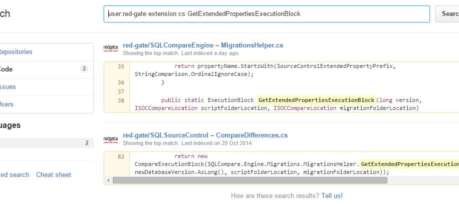

Searching in github is one of those features I’d known about for a while but never actually used very often. It turns out that github search has a [wide range of modifiers](https://help.github.com/articles/searching-code/) that can be used to make it pretty useful.

In particular, github-wide search (the one on the [home page](http://github.com/)) can be a lot more useful than it sounds. By default, it returns results from all repositories you have access to - including the massive range of open-source public repositories from all those other people who use github. But if you add the `user:` modifier, then suddenly it only returns results from a certain user or organisation. Adding the `language:` modifier means you can filter out all the non-code cruft that tends to normally clog up search results.

So, to take an example from a couple of days ago, I was thinking of changing a method in a shared library called `GetExtendedPropertiesExecutionBlock` and wanted to know where it was used. This is what the search looks like:

so we can see that this function is only used in one other place.

In fact, this seems like it’ll be pretty useful in the future, so I turned it into a custom chrome search. To do this, right-click on the search bar in github and choose “Add as search engine…” from the dropdown. Find the `%s` in the url listed, and add the modifiers you want just before it. The `%s` part will be replaced with the text that you want to search for. Make sure to change the keyword to something short and memorable - I used "cs", so I can open a new tab, type "cs" and then the code I want to search for pretty damn quickly.

It’s worth noting that while github search is pretty fast, it’s also fairly limited - it won’t include any symbols or consider word order in the results. This means it’s mostly useful for looking up certain class or method names rather than searching for whole snippets of text.
