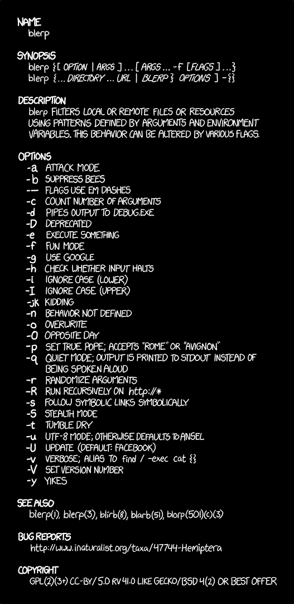

<figure>



<figcaption>

[https://xkcd.com/1692/](https://xkcd.com/1692/)

</figcaption>
</figure>

There are plenty of CLI parser libraries out there for pretty much every programming language under the sun. However, sometimes you might not find one with the right combination of features you want, or maybe you just want to understand what makes them tick. Building a CLI parser is probably much easier than you think!

To begin with, we're going to assume we're passed some arguments as a string array, and we don't have to worry about [any complicated shell escaping rules](https://devblogs.microsoft.com/oldnewthing/20100917-00/?p=12833)! This makes our life much easier already.

**Quick note:** I’ll try to stick to the convention of talking about “parameters” for the various options we define, and “arguments” for the actual values passed to those parameters

#### Our first CLI parser

Let’s assume that we want to handle a decent number of possible parameters, and some (or all) of those parameters might be optional. If we only want to handle a small, fixed number of **positional parameters**, you can usually get away with something pretty simple:

```
using System;
public static class SimpleArgs
{
    public static int Main(string[] args)
    {
        if (args.Length < 2)
        {
            Console.WriteLine("Usage: foo.exe [api key] [target]");
            return 1;
        }

        var apiKey = args[0];
        var target = args[1];

        // do something with apiKey and target...

        return 0;
    }
}
```

Imagine we want to switch to **named parameters** like `--apiKey` and   
`--target` to make code using the CLI more readable.  
The main complication is we can now specify the arguments in either order:

```
> foo.exe --apiKey abcd1234 --target production
> foo.exe --target production --apiKey abcd1234
```

The key thing to notice here is that we always **alternate between a parameter name and an argument value**. Instead of addressing specific `args` elements directly, we’ll iterate through the list and match up each argument with the right parameter:

```
using System;
public static class ArgsLoop
{
    public static int Main(string[] args)
    {
        string currentParameter = null;

        string apiKey = null;
        string target = null;

        foreach (var arg in args)
        {
            if (currentParameter == null)
            {
                currentParameter = arg;
                continue;
            }

            if (currentParameter == "--apiKey")
            {
                apiKey = arg;
                currentParameter = null;
                continue;
            }

            if (currentParameter == "--target")
            {
                target = arg;
                currentParameter = null;
                continue;
            }

            throw new Exception("Unexpected arg " + arg);
        }

        Console.WriteLine($"Got {apiKey} and {target}");
        return 0;
    }
}
```

In this loop `currentParameter` acts as a **tiny state machine**: either it’s set to some value and we’re expecting an argument value next, or it’s unset and we’re expecting a parameter name next.

We’re pretty close to making this into a generic parser! The next key insight comes from the design of CLI parser libraries like `NDesk.Options` or `Mono.Options`: we want to provide a list of parameter names and a **callback** for each one:

```
using System;
using Parameters = System.Collections.Generic.Dictionary<
                       string, System.Action<string>>;

public static class GenericLoop
{
    public static int Main(string[] args)
    {
        string apiKey = null;
        string target = null;

        var parameters = new Parameters {
            {"--apiKey", x => apiKey = x},
            {"--target", x => target = x},
        };

        Parse(parameters, args);

        Console.WriteLine($"Got {apiKey} and {target}");
        return 0;
    }

    private static void Parse(Parameters parameters, string[] args)
    {
        string currentParameter = null;
        foreach (var arg in args)
        {
            if (currentParameter == null)
            {
                currentParameter = arg;
            }
            else if (parameters.TryGetValue(currentParameter,
                                            out var callback))
            {
                callback(arg);
                currentParameter = null;
            }
            else
            {
                throw new Exception("Unexpected value: " + arg);
            }
        }
    }
}
```

And that’s it! We could totally stop here if we wanted. But there’s plenty of improvements we can make from this point, too.

With a slight tweak, we can allow for parameters which don’t take a value. This is useful for boolean flags like `--quiet` and similar. First we add the new parameter to our list:

```
        string apiKey = null;
        string target = null;
        bool silent = false;

        var parameters = new Parameters {
            {"--apiKey", x => apiKey = x},
            {"--target", x => target = x},
            {"--silent", _ => silent = true},
        };
```

(Note how the new callback ignores values given to it and just sets the flag.)

Secondly, we change the loop to prioritize matching parameter names over satisfying parameters:

```
    private static void Parse(Parameters parameters, string[] args)
    {
        Action<string> currentCallback = null;
        foreach (var arg in args)
        {
            if (parameters.TryGetValue(arg, out var callback))
            {
                // if the previous arg was a parameter name, then it
                // has no value
                currentCallback?.Invoke(null);
                currentCallback = callback;
            }
            else if (currentCallback != null)
            {
                // This arg doesn't match any parameter names, so it
                // must be an argument value.
                currentCallback(arg);
                currentCallback = null;
            }
            else
            {
                throw new Exception("Unexpected value: " + arg);
            }
        }

        if (currentCallback != null)
        {
            // we've run out of arguments to pass, but there's still
            // a pending parameter
            currentCallback(null);
        }
    }
```

Previously, if we saw arguments like `foo.exe --target --apiKey` , then we would have assumed that `"--apiKey"` was the value passed to `--target`. The updated code will invoke both callbacks for `--target` and `--apiKey` with `null` instead. The advantage is we can now call a CLI like this:

```
> foo.exe --silent --apiKey abcd1234 --target staging
```

and all the values will get set correctly, even though `--silent` didn’t get passed a value.

---

#### Personalizing your parser

It might not look like much, but this little loop can be the foundation for a lot of parser features:

- Now that we have a programmatic list of all the arguments, we can generate help text when something goes wrong, or if the user specifies a   
   `--help` argument. We could also add description text for each of the parameters and print that out too.  
   Error handling can be a bit tricky: we need to either throw and catch a custom `ShowHelpException`, or stop the process ourselves with `Environment.Exit(1)`. Both methods work but have their own problems, so play with them and see which is the best fit for your case.
- Currently if we want to have multiple aliases for each parameter, we need to repeat the whole parameter definition including the callback. A nice quality of life feature is supporting multiple aliases within the parameter spec, so eg `"-q|--quiet"` provides two alternatives for a quiet parameter.
- One extra feature we needed was environment variable support for passing more sensitive arguments. Extending the above idea, we assumed environment variables followed a SHOUTY_SNAKE_CASE convention, so used parameter specs like `"-p|--password|DATABASE_PASSWORD"`. Environment variables get checked first, so they can be overridden by cli arguments later if required.
- The loop currently only supports named parameters, but we can add support for positional parameters too. The trick is to keep a separate queue of positional parameters, then check whether there are any remaining before carrying on with the error case:

```
    // track how many positional parameters have been consumed
    var position = 0;

    // ... same loop as before ...

    }
    else if (position < positionalParams.Length)
    {
        positionalParams[position].Handler(arg);
        position++;
    }
    else
    {
        // and raise error as before
```

- We only support string parameters, but you can easily add support for other parameter types. Just wrap the callbacks in code which implements parsing for integers, enums, `FileInfo`s or any other custom type you need. You may find it helpful to replace the dictionary with a list of `Parameter` classes, then subclass for `BoolParameter`, `IntParameter` and so on.

That’s just a brief and incomplete list — once you have your own parser code that you’re fully in control of, you can implement as many or as few features as you need! I’d recommend starting off as minimal as possible. Don’t be afraid to implement one-off features outside the parser at first. Aim to convert these features into generic parser code once you have a few examples to guide you.

---

#### Reflection-based parsing

So our callback-based parser, while nice and simple to implement, isn’t very ergonomic. We have to set up a bunch of mutable variables, call the parser to populate them, and then manually verify that required parameters have a value. We’ll probably also want to also bundle the variables up into an options object to pass to the rest of the program.

What modern CLI parsing libraries tend to implement is something a bit more “magic.” They let us decorate a class representing the various parameters with attributes for how each parameter is specified, and then automatically create an instance of that class. Let’s dig in to how we might actually implement this using reflection in C#: other languages will differ, but the main concepts should be the same.

This process is going to consist of four steps:

- Use reflection to inspect the passed-in class, and find the attributes with parameter specifications.
- Build a callback-based parser with the list of parameters we’ve discovered, and implement callbacks that store the argument values in some intermediate bucket.
- Run the callback-based parser against the args list.
- Use reflection again to call the class’s constructor with the list of parameters‍ from the parser.

Once we’re done we’ll be able to define a class like this:

```
public class Example
{
    [Parameter("-a|--apiKey|FOO_API_KEY")]
    public string ApiKey { get; }

    [Parameter("-t|--target")]
    public Target Target { get; }

    [Parameter("-s|--silent")]
    public bool Silent { get; }

    public Example(string apiKey, Target target, bool? silent)
        => (ApiKey, Target, Silent)
         = (apiKey, target, silent ?? false);
}
```

and have our parser output nicely immutable, ready-to-go instances from the CLI arguments.

First we need to define a new attribute type:

```
public class ParameterAttribute : Attribute
{
    public string Spec { get; }

    public ParameterAttribute(string spec) => Spec = spec;
}
```

It’s pretty minimal — if you want you can add extra properties like some help text to make it more friendly. We’ll just be passing the values down into our callback parser, anyway.

Let’s get started with the actual Parse method:

```
    public static T Parse<T>(string[] args) where T : class
    {
        var type = typeof(T);
        var props = type.GetProperties()
            .Select(p => (
                  name: p.Name,
                  attr: p.GetCustomAttribute<ParameterAttribute>()))
            .Where(x => x.attr != null)
            .ToList();
```

The first thing to notice is that the method is static and generic. The `T` type parameter gives us an implicit reference to the type of parameter object to create. The `typeof` operator turns the implicit reference into an explicit value that we can inspect. Next, we search the list of properties on the type and find those with a `Parameter` attribute.

Once we have a set of parameters with their matching C# properties, we need to find a constructor which has an equivalent list of parameters:

```
        var propNames = props.Select(x => x.name).ToArray();
        var constructor = type.GetConstructors()
            .Where(c => ConstructorMatchesProps(c, propNames))
            .Single();
```

This means that once we’ve parsed all the parameters, we should have a set of values to call the constructor with. We assume that the constructor will do the obvious thing and pass its arguments to the equivalent properties, but the constructor is also allowed to implement extra behavior like default values. This will come in handy later when we want to implement optional parameters.

Some other libraries assume a different convention, and [require the constructor parameters to match the order of properties on the class](https://github.com/commandlineparser/commandline/issues/188), but this feels a bit more fragile. Of course, given you control this code you can make whatever implementation decisions are best for you :)

The next step is to build up the underlying parser:

```
        var argsBucket = new Dictionary<string, object?>(
            props.Count,
            StringComparer.OrdinalIgnoreCase);

        var parameters = new List<Parameter>();

        foreach (var prop in props)
        {
            parameters.Add(
                new Parameter(
                    prop.attr.Spec,
                    x => argsBucket[prop.name] = x));
        }
```

Previously we had explicit variables to hold the results of each callback, but now we collect everything into a big `Dictionary`. The store here needs to be case-insensitive, since in C# constructor parameters and property names will have different case by convention.

Once that’s all set up, we just run the parser we built earlier:

```
        CallbackParser.Parse(parameters, args);
```

and `argsBucket` should be filled with all the values from the commandline.

At this point we can do something new: check for required parameters. We’re still in the parser code and we have a reference to all of the argument values, which we didn’t have before with the callback-based parser.

Usually we’d use a `ParameterAttribute` property to make parameters required or optional, but with C#’s new [nullable reference types](https://docs.microsoft.com/en-us/dotnet/csharp/nullable-references) we can go one better and use a language feature. The nullability of each constructor parameter tells us whether the relevant option is required. This is a bit unintuitive (why don’t we use the nullability of the properties themselves?) but it means we can easily put default values in the constructor, like how `--silent` defaults to `false` in the example above.

```
      var requiredParams = constructorParams
          .Where(p => !Utils.IsNullable(constructor, p.param))
          .ToArray();

      var errors = new List<string>();

      foreach (var (attr, parameterInfo) in requiredParams)
      {
          if (!argsBucket.ContainsKey(parameterInfo.Name!))
          {
              errors.Add("Missing argument: " + attr?.Spec);
          }
          else if (argsBucket.GetValueOrDefault(parameterInfo.Name)
                   == null)
          {
              errors.Add("Missing argument value: " + attr?.Spec);
          }
      }

      if (errors.Any())
      {
          throw new Exception(string.Join(",", errors));
      }
```

[Here’s an implementation of that](https://gist.github.com/nyctef/b9c69ee44cebc7df9cc0eaab9c9a5076) `[Utils.IsNullable](https://gist.github.com/nyctef/b9c69ee44cebc7df9cc0eaab9c9a5076)` [function](https://gist.github.com/nyctef/b9c69ee44cebc7df9cc0eaab9c9a5076) — it’s a bit too big to include inline!

After all that, the actual magic part is a bit underwhelming. We build up the array of constructor arguments, invoke the selected constructor, and cast the result to the output type:

```
        var constructorArgs = constructor.GetParameters()
            .Select(p => argsBucket.GetValueOrDefault(p.Name!))
            .ToArray();

        return (T)constructor.Invoke(constructorArgs);
```

And that’s it! To use this, we just call `Parse<Example>(args)`, and get a constructed`Example` object with all the properties filled in. I think you’ll agree this is a much nicer interface to work with.

---

To sum up, hopefully you’ve seen a few things:

- We can build a simple CLI parser in a few lines of code.
- Once we have our own CLI parser, we can add features much more easily compared to a third-party library.
- We can use reflection to provide a much nicer “magic” parsing style, while building on top of a simpler parser.

If you want more, you might also like “[Building a virtualized list from scratch](https://medium.com/ingeniouslysimple/building-a-virtualized-list-from-scratch-9225e8bec120)”, or Gary Bernhardt’s excellent [FROM SCRATCH](https://www.destroyallsoftware.com/screencasts) screencasts which inspired these posts
