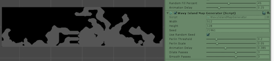
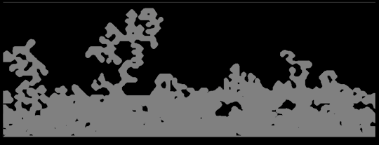
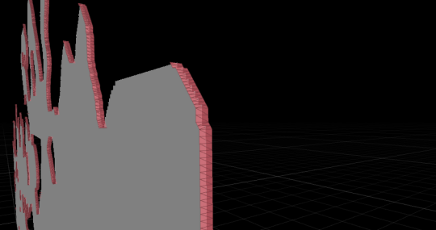

Code for [unreal](https://github.com/nyctef/unreal-playground/blob/110f74cbaa43da67f74de7037d60092e22654d0e/UETut_2DSideScroll_1/Source/UETut_2DSideScroll_1/TerrainMesh.cpp) and [unity](https://github.com/nyctef/unity-playground/blob/1babb8e22f1a87e1176010167b8cb9df707f60d2/worms-map-generation-tests/Assets/Scripts/MapGeneration/WavyIslandMapGenerator.cs) on github

This is something I’ve been playing around with for a couple of weeks now. I started off in unreal engine, but got annoyed after a while (my C++ skills aren’t that great and the long compile times kept getting in the way).

Anyway, the same basic approach seems to work in both, so maybe I’ll switch back once I have a more complete prototype working in Unity.

The main idea is to generate a grid of 2D points which represent the map in an abstract sense, and then build two objects from that: a sidewards-facing collision mesh (invisible to the player, handles physics) and a front-facing “display” mesh with a generated texture matching the created map. This is almost certainly not how the original Worms games were programmed, but it means we can use the engine’s builtin physics engines without having to implement some custom per-pixel collisions.

The collision mesh is generated with a marching squares implementation based on the map representation [Sebastian Lague’s&nbsp;“Procedural Cave Generation” youtube videos](https://www.youtube.com/watch?v=v7yyZZjF1z4&list=PLFt_AvWsXl0eZgMK_DT5_biRkWXftAOf9) were very helpful when figuring out this approach. Instead of starting out with random noise, though, the algorithm uses a modified version of perlin noise, thresholds it, and then picks out continuous areas to turn into terrain (ref: [[1]](https://gamedev.stackexchange.com/a/20606/114877) [[2]](https://gamedev.stackexchange.com/a/20957/114877)). Then a few iterations of dilate and smooth operations are run

Here’s the generation working on a larger scale: as you can see it could probably do with a bit more smoothing (or mayber a larger amount of smoothing on each pass)

And here’s what the collision mesh ends up looking like:

Probably the most fiddly part of the whole thing was making sure all the triangles in the 16 different marching squares cases were ordered correctly (clockwise for unity, anticlockwise for unreal IIRC) but once that was out of the way then the mesh behaved pretty well
