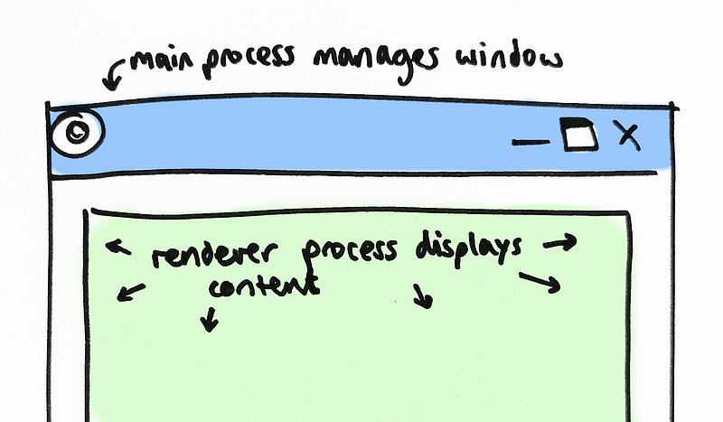
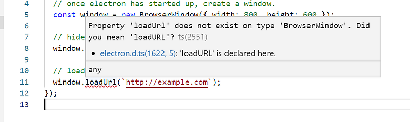
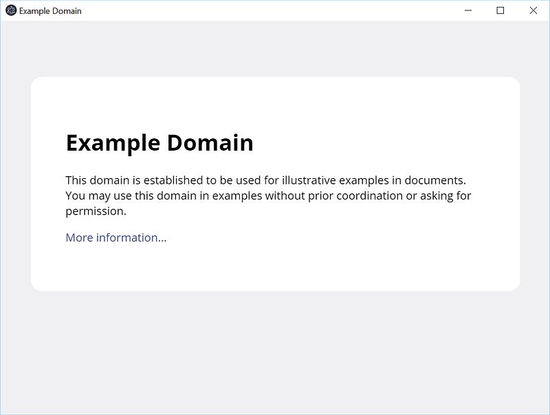

At the moment, Electron apps are the easiest way to quickly build a cross-platform GUI application. While [not without its share of problems](https://news.ycombinator.com/item?id=14089184), Electron (or similar Chromium-based tech) is used in a wide variety of modern applications such as VSCode, Steam, Slack and Spotify.

In this series we’re going to take a deep dive into all the various components that make up an electron app. There’s a lot of moving parts, and in reality we’ll usually just [start with some boilerplate](https://electronjs.org/docs/tutorial/boilerplates-and-clis) and then get on with actually developing an app. But while that’s the more practical way to use electron, there’s also value in pulling apart the pieces and make sure we know what everything does.

I can’t claim to be an expert here — I’m mostly a .NET developer, and while I’ve built a couple of complex Electron apps I’m still learning how to do it properly. I’ll also not go into any one technology in too much detail — there are plenty of excellent resources on the internet if you want to investigate something further. Besides, I want to avoid this text getting any longer than it already is!

This series is mostly inspired by [Gary Bernhardt’s excellent ‘From Scratch’ series of screencasts](https://www.destroyallsoftware.com/screencasts/catalog#from-scratch), which demystify common tools by actually showing you how to build one. While we’re not going to go as low-level (we’ll be building on top of Electron rather than building Electron itself) I hope this series will be helpful for a similar reason. Knowing your tools means you can be less afraid of the magic you’re building on top of, and make sure you’re informed about whether all the libraries you’re pulling in are worth the cost.

I’ve created a [github repo](https://github.com/nyctef/electron-from-scratch) which you can check if you want to see the source code in context.

---

With that all sorted out, let’s get started:

### Overview

An electron app is made up of two parts: a website, and a mini-browser which displays that website. Electron itself is built from the chromium code, and a node.js hosting process. The two sides are often called the “main” process and the “renderer” process. This process separation isn’t particularly helpful for us, but [it’s an important part of how Chrome works](https://www.google.com/googlebooks/chrome/big_04.html) so we’re stuck with it.



We’ll spend a bit of time setting up the window, but most of the work ends up happening in the actual website we want to display.

---

### Creating a browser window

Let’s build the main electron process first, since we can show that off without having to build a website just yet.

Our first port of call is going to be setting up an [npm](https://www.npmjs.com/) project. We’ll use npm to manage all the various packages we depend on, and it serves as a handy place to keep our build scripts.

<code class="block">
<b>></b> mkdir electron-from-scratch
<b>></b> cd electron-from-scratch
<b>></b> git init
<b>></b> npm init
</code>

npm will ask a bunch of questions, and then generate a `package.json` file based on the answers provided. It doesn’t matter too much what we write here, since we’re not expecting to publish this package as a library for other people to consume. In fact, let’s ensure we don’t publish it by accident, by setting the `private` property in the config:

```
[...]
 "private": true
}
```

This means npm will refuse to publish our package, even if we tell it to.

Now that we have npm set up, we’ll start using it:

<code class="block">
<b>></b> npm install --save-dev electron
</code>

This updates `package.json` to add electron as a dependency, and also creates a `package-lock.json`. The latter is useful since it stores the exact version of every dependency and transitive dependency we’ve installed, ensuring a consistent build for any particular commit.

Our minimal electron script looks something like this:

Electron will start running, and once it’s ready we create a window to display a webpage of our choice. We’ll put this file in `src/electron/index.js` — the eventual plan is for a folder structure that looks like this:

<code class="block">
<b>root</b>
> <b>package.json</b>
> <b>src/</b>
> <b>electron/</b>
&nbsp;&nbsp;[code to implement the main electron process]
> <b>website/</b>
&nbsp;&nbsp;[code to define the website that we're hosting in electron]
> <b>out/</b>
&nbsp;&nbsp;[contains compiled/bundled versions of src/ folders]
> <b>dist/</b>
&nbsp;&nbsp;[contains packaged version of the app, ready to release]
</code>

We can now run our electron app like this:

<code class="block">
<b>></b> ./node_modules/.bin/electron ./src/electron/index.js
</code>

but that’s a bit unwieldy to type out every time, so we’ll define an npm script in `package.json` to hold that command:

```
"scripts": {
 [...]
 "start": "electron ./src/electron/index.js"
 },
```

npm puts `./node_modules/.bin/` into the path when we run npm scripts, so we don’t have to specify that part. We can now use `npm start` to run our electron app.

---

There’s just one small problem here: the above script doesn’t actually work! (Can you spot the typo?)

I’m too lazy to carefully read through our script looking for errors, so we’ll get the computer to do it for us instead ;)

### Introducing typescript

Typescript is a compiled language which [retains the expressive power of javascript](https://medium.com/ingeniouslysimple/typescript-or-how-i-learned-to-stop-worrying-and-love-web-development-deebe44c8794), but makes it much easier to write correct code without having to think too hard. I’m going to add it early in this series since it helps me write Javascript faster. Depending on how good you are with JS already, you might make a different choice.

The first step is to grab typescript:
<code class="block">
<b>></b> npm install --save-dev typescript
</code>

Typescript configuration is stored in a tsconfig.json file, which we create with `./node_modules/.bin/tsc --init`. This file contains a list of all the relevant options, as well as a brief summary of each one. The defaults are mostly sensible, and we’ll just make a couple of tweaks: setting the target language version to a newer edition like ES2017 and setting the outDir and rootDir options to `./out` and `./src` respectively. The first change isn’t strictly necessary, but having newer language features available is always nice.

Our build script is very simple:

```
"scripts": {
 [...]
 "build": "tsc"
 },
```

And the final change is to rename `index.js` to `index.ts`.

Now we can call `npm run build` and see how the files in `./src` get mapped into `./out`. We’ll need to change the `start` script as well so that electron runs `./out/electron/index.js` instead of our typescript file.

After all that effort, we come to the punchline:



D’oh!

A quick fix later, and our electron app is finally running:



It’s alive! It’s not very impressive…

One downside of our new compile step is that it’s pretty slow: on my machine, it takes a few seconds to run `tsc`, even with this tiny example. We can get rid of some of that slowdown by running the compiler in “watch mode” — the compiler will turn into a long-running process, keep compilation state in memory and then only do incremental builds when files change. The downside (as is often the case with long-running state) is [reduced stability](https://twitter.com/garybernhardt/status/1073005369155215360): the compiler will occasionally get stuck and need to be restarted to pick up some latest changes or figure out how to typecheck things correctly.

Watch mode is still convenient, though, so let’s add a second npm script for it:

```
"build:watch": "npm run build -- --watch"
```

Note how we call `npm run build`, and then add `-- --watch`. The first `--` tells `npm run` to stop processing arguments, and just pass the remaining arguments into the script being run. This means the `--watch` gets appended to the end of our `tsc` call from the `build` script, and the actual command which gets run is `tsc --watch`:

<code class="block">
<b>></b> npm run build:watch
> electron-from-scratch@0.1.0 build:watch C:\git\electron-from-scratch
> npm run build -- --watch
> electron-from-scratch@0.1.0 build C:\git\electron-from-scratch  
> tsc "--watch"
[14:33:04] Starting compilation in watch mode...  
[14:33:06] Found 0 errors. Watching for file changes.
</code>

Now typescript will do a minimal recompile each time a file changes, which is much faster.

---

We now have electron running, but it’s just showing a random page from the internet. [In the next part, we’ll look at building the actual application we want to display](https://medium.com/p/aaa625207c12).


Photo by [Zoltan Tasi](https://unsplash.com/@zoltantasi?utm_source=unsplash&utm_medium=referral&utm_content=creditCopyText) on [Unsplash](https://unsplash.com/?utm_source=unsplash&utm_medium=referral&utm_content=creditCopyText)
