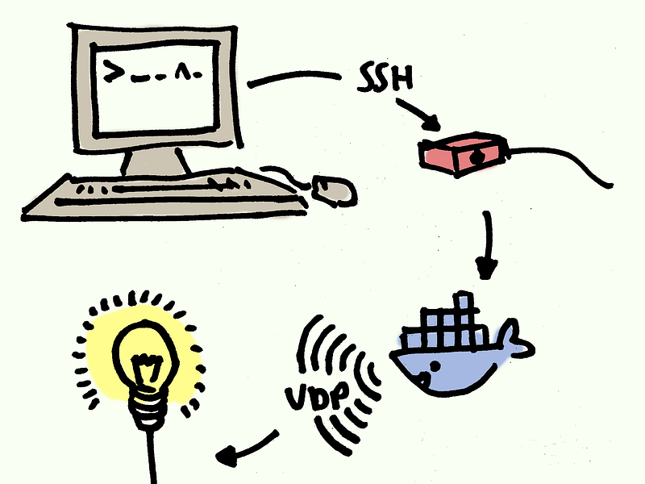
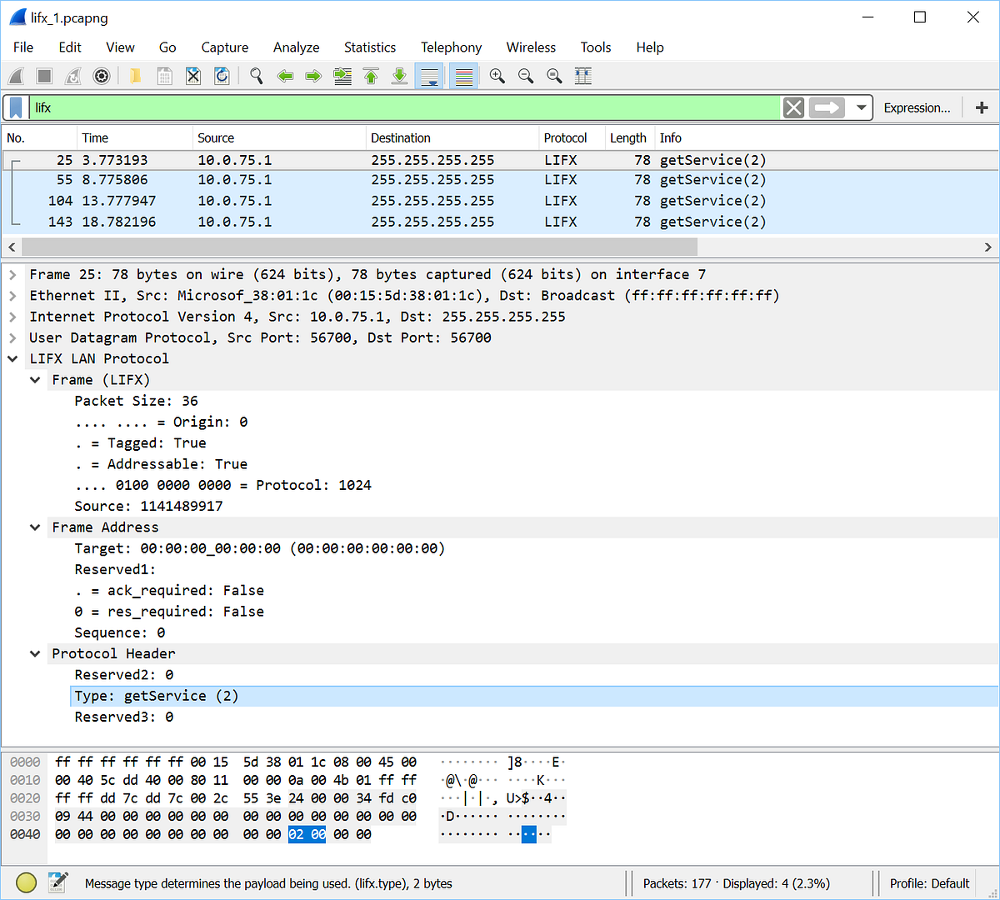

Over the past few days I’ve been playing around with code to automate the “smart” light bulb that I’ve recently acquired. This was partly motivated by a desire to try something a bit different from the usual app development, but mostly because my phone died and I needed a different way to control it for a while! (Of course, just using the official Windows app would be too easy ;)

Along the way I discovered the mind-blowing number of layers we can get involved — at the network, application and OS level — and this blog will be a very quick tour of some of the bits of complexity I came across.

---

I started by poking around the internet for a bit and found [some good documentation](https://lan.developer.lifx.com/docs/introduction) for the protocol that my bulb uses locally. I also found [LifxNet](https://github.com/dotMorten/LifxNet/) which provided a great starting point for code to work with.

The first hurdle that I ran into was, well … it didn’t work. I tried creating a simple commandline which used the LifxNet package and reproduced the sample code, and it seemed to be sending out discovery packets correctly, but I wasn’t getting anything in response.

I spent a good couple of hours fiddling around with various things — [forking the actual LifxNet code](https://github.com/nyctef/LifxNet) and trying out various tweaks — before giving up and installing the official Windows app.

The upshot is that I was now able to use Wireshark to compare network traffic from the official app with the packets that my code was producing. As a _super_ helpful bonus, [mabvot9usa’s “Wireshark LIFX Dissector” plugin](https://github.com/mab5vot9us9a/WiresharkLIFXDissector) gives Wireshark the ability to parse the relevant packets and present them in a somewhat human-readable format.

Initially everything looked correct:



A Wireshark capture, filtered to only show LIFX packets. You can see how different network layers and sections of the LIFX LAN protocol map onto bytes in the actual packet.

That’s showing a bunch of well-formed discovery (`getService`) messages, which appear to be getting sent correctly … the a-ha! moment occurred when I realized they were only getting sent from `10.0.75.1`! It turns out that my computer has a bunch of network interfaces set up, but only a couple of them are useful for talking to other devices on the local network. `10.0.75.1` in particular is on a network only used for local Docker containers (more on those later…)

So, to back up a bit:

- The way that we start interacting with the lights is to broadcast a certain discovery packet (shown above) to the local [subnet](https://en.wikipedia.org/wiki/Subnetwork). We can broadcast UDP packets by sending them to the reserved address `255.255.255.255`.
- Any devices that receive this message will respond with a unicast message directed back at the original sender. This response is basically constant at the moment (it says “I’m listening on UDP port 56700”) but could change in the future.
- The problem is with that “local subnet” part. It turns out my computer is connected to multiple subnets through multiple network interfaces, and we were sending packets to the wrong one.

The solution to this first problem is fairly straightforward, if a little blunt: we just need to enumerate the network interfaces, set up a UdpClient for each one, and then make sure we broadcast our discovery request to everywhere we can reach:

---

Once we’ve successfully discovered a light bulb on the network, the next step is to actually configure it somehow (or even just turn it on!) There’s a slight hurdle that our previous strategy doesn’t work here:

> “A socket operation was attempted to an unreachable network”

It turns out that we want to broadcast discovery on every interface — but once we discover a device at a particular address, we can only attempt to send messages to it through the correct network interface for that address. The above error is what happens when we try to talk to an endpoint that isn’t reachable from the network interface that we’re trying to use.

The solution here is a little tricky: I think we need to track responses from our discovery message, remember which UdpClient received the response, and then reuse that UdpClient every time we subsequently want to talk to that device.

At this point I ended up deviating from the original library code significantly: while the original code is great (and I definitely wouldn’t have been able to get started without it) I found it a bit confusing to follow at times. I ended up trying to split it into a few layers to separate out different jobs the code was doing:

- **Network level**: Code which wraps .NET’s UdpClient (for single vs multiple interfaces) and provides a basic send/receive interface.
- **Protocol level**: This is the level that knows about the LIFX protocol — which messages are available and how to create/parse the bytes for each message.
- **“Conversations” level**: This is the main tricky part — how to join messages together into request/response pairs. The protocol lets us do this by setting “source identifier” and sequence numbers to correlate different messages together. This is probably the level where timeouts should be implemented, although I haven’t done that yet (or really any good error handling).
- **Client level**: the top-level API for everyone else to consume. For example, this wraps creating a message and sending it into a single “turn light on” function call.

I don’t think I’ve done a great job here yet — there’s definitely a lot that could be improved in my version of the code. But I think the layers here are roughly sensible.

---

Something else I wanted to play with was getting a Docker container created for the new commandline tool. This turned out to be surprisingly straightforward! I basically took the [official sample Dockerfile](https://github.com/dotnet/dotnet-docker/blob/caa1da581ff2e7f2246959c751ad59bfd6604ee7/samples/dotnetapp/Dockerfile) for a .NET app and [changed the details to match the existing code](https://github.com/nyctef/LifxNet/commit/63493b2ec72b64cfb56be0594216879c11f0f110#diff-3254677a7917c6c01f55212f86c57fbf).

The really cool thing about building a docker container is that we can now easily build and publish it:

```
docker build . -t nyctef/lifxctl
docker push nyctef/lifxctl
```

… and then we can run this:

```
docker run --rm nyctef/lifxctl light off --device-spec D0:73:D5:12:34:56@192.168.0.44:56700
```

on any machine with docker installed, and it’ll download the image, run the embedded commandline and turn off our light without any additional setup required!

…that is, until we try to run this on the Pi, in which case we get a confusing error:

```
[...]
standard_init_linux.go:207: exec user process caused "exec format error"
```

After some googling, it turns out this is the error we get if we try to run x86 code on an ARM device — the machine code isn’t in a compatible format, so we get an error trying to execute it. This means we need to build different docker images for x86 and ARM devices.

Normally this would involve creating a separate Dockerfile for each image we want to build, which is a little annoying. However, with the new “multi-stage build” feature, we can fix this fairly easily by adding another build target to the existing Dockerfile:

We then just need to tweak the build script to specify which image we actually want to output from the build:

```
docker build --target runtime -t nyctef/lifxctl:latest .
docker build --target runtime-arm32v7 -t nyctef/lifxctl:arm32v7 .
```

The actual build step image should be cached between the two build runs, so this is nice and fast.

Now we just use `nyctef/lifxctl:arm32v7` as the image to run on the Pi, and everything works!

---

So, to sum up: we’re connecting to a Raspberry Pi over ssh, using docker to download and run our commandline, sending UDP packets to discover and control our device, all in order to turn on a lightbulb. Yep, seems simple enough to me! :)

In the longer term I’m hoping to use the always-on Pi to automate the light at different times of the day and make all this complexity worthwhile, but in the meantime it’s been fun to play around with all these different pieces.
