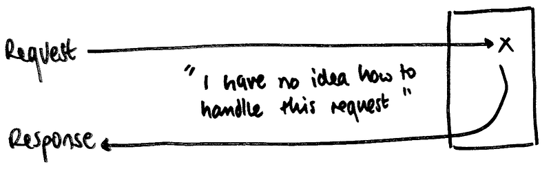
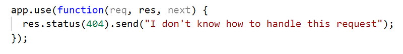
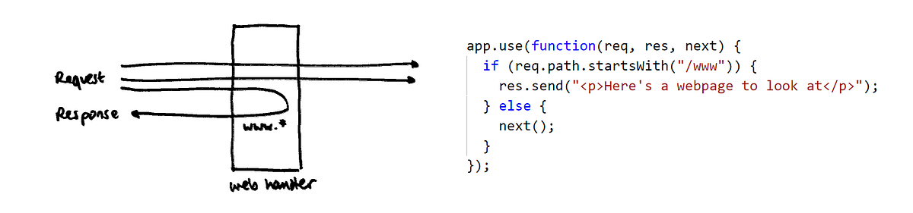
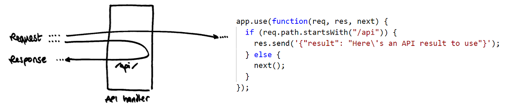
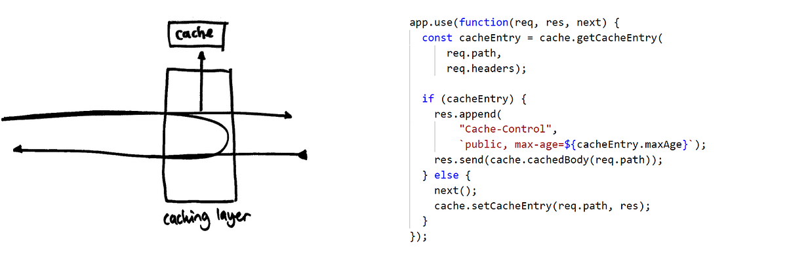
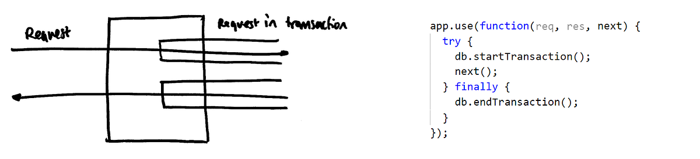
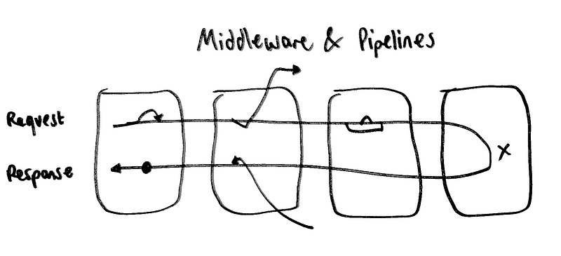
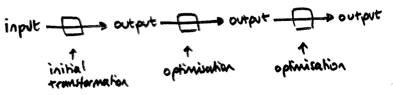
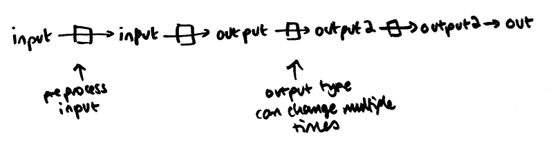
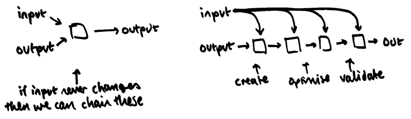

Let’s look at a fairly powerful programming pattern that’s popped up a few times recently: building an extensible operation out of a pipeline of “middleware” components.

The core requirements for this pattern are an input type, an output type, and a grab-bag of cross-functional requirements for various things we’d like to do when turning one into the other.

The most common place this pattern appears is in handling web requests — we want to accept a web request, do some processing on it, and then create an appropriate response object that gets given back to the client. The [expressjs](https://expressjs.com/en/guide/using-middleware.html) and [OWIN](http://benfoster.io/blog/how-to-write-owin-middleware-in-5-different-steps) APIs are explicitly built around this concept, but some other web frameworks work in the same way.

We need to have some default case for our pipeline. In the web request example, if we have no idea how to handle a request, then we just return a 404:

We’ll add a web handler that knows how to handle some URLs, but passes others down the pipeline:

We can compose this with an API handler which knows how to handle `/api` requests:

We might want to add a caching layer. This shows how we can modify the request and response objects as they move up and down the pipeline:

(Obviously this isn’t an example of real code, but vaguely suggests how a caching layer like this might work :)

We don’t have to directly modify the request and response — we can also cause other side-effects at the right point in the pipeline:

The important thing we’ve seen so far is that each piece of middleware we’ve built can consider the rest of the pipeline as a black box, and generally act independently of every other piece of middleware. There can be some loose coupling, however, since middleware often relies on being ordered in a certain way — for example, our caching layer probably assumes that it’s somewhere near the front of the pipeline.

Each middleware function needs access to the current state of the input, output and the next function in the pipeline to call. In the expressjs example we mutated the request and response values as necessary, but a more functional chain can also be implemented where middleware functions are of the form `(input, next)->output` and the `next` function gives us the `input->output` function implemented by the rest of the pipeline.

We’re generally not limited at all in what we can do in any single piece of middleware — for example, a piece of proxy middleware could decide to rewrite a request entirely, or send it down an entirely different pipeline if appropriate. At the other extreme, a piece of logging middleware might not actually touch the request/response flow at all, but just passively log what’s going on each time it is executed.

---

Redux extensibility is another place that middleware pops up frequently. The redux architecture is well-suited to a middleware-based implementation: the input type is just the previous state plus an action, and the output type is just the next state. The reducers themselves act as the base case for the pipeline.

Redux middlewares are commonly used to implement [logging](https://github.com/evgenyrodionov/redux-logger) and [extra features for dispatch](https://github.com/reduxjs/redux-thunk/blob/master/src/index.js). The redux docs have [a more detailed guide to writing milddleware](https://redux.js.org/advanced/middleware) (and the justification behind how the middleware API works) so I won’t go into too much detail here.

We’ve written a few custom middleware implementations for our current masking application. Since reducers are not supposed to trigger side-effects, middlewares often feel like nicer places for triggering actions such as bringing up Intercom, firing telemetry events or triggering Windows notifications. The fact that middlewares can see both the previous and next states as well as the current action being processed means they can focus in on specific state changes in the application, without having to be embedded in some specific reducer or React component.

---

We’re currently building a product for masking relational databases with sensitive data. One of our goals for the product is to have a relatively simple interface, but enable intelligence and performance optimizations under the hood. To that end the user configures how they want the database to be masked with a simple declarative interface, but we convert that to a series of masking steps which can be run in sequence or in parallel as appropriate.

This is another problem which turns out to be suitable for a similar pipeline structure: we use the declarative list of masks and columns as an input, and the list of masking steps as an output. Individual bits of middleware handle different features and concerns along this conversion process — for example some masks can be converted into a whole column UPDATE statement, while others need to be implemented with a row-by-row process. Once the basic steps list has been created, it can be modified to add synchronization between tables or conditionality to certain masks. A side benefit is that we can swap out different behaviors or enable features based on feature flags by just inserting and removing middlewares from the step conversion pipeline.

Interestingly, most of our standard middlewares in this case differ from the web request middlewares above. For web requests, the standard pattern is that we’ll either handle the request entirely, or delegate down the pipeline. When we’re creating masking steps, however, most middlewares handle some of the request but delegate the rest to whatever’s next in the pipeline — the two results are then concatenated before continuing.

Pipelines with middleware are a very powerful tool, but they aren’t without downsides. One source of confusion I’ve found is that the order of execution isn’t very clear or intuitive, because execution happens both forwards and backwards across all the middleware functions. This can be a problem when the list of middlewares is defined somewhere in code — it can be easy to assume that this order is the same order that the middleware will execute in.

In one case, we avoided using the full power of middlewares because the team decided that the resulting code was too complicated. We were implementing a feature called “conditional masking”, where a conditional mask basically composes a set of other masks and chooses one of the masks to apply to each row based on some condition. The initial solution that was developed had a conditional middleware near the top of the pipeline, which unwrapped the conditional mask into a set of underlying masks, used the rest of the pipeline to turn those underlying masks into steps, and then reassembled the conditional mask on the way back up. This worked well, but in the end we refactored that conditional middleware to use a separate solution which didn’t delegate down the pipeline.

---

It’s important to realize whether you actually need the middleware pattern or not. If you’re building for extensibility, then middlewares are amazing — since they let your potential future plugins do pretty much anything. If you control the entire pipeline yourself, though, and you’re not using the full power that middleware allows, then there are much simpler patterns which can provide similar results.

The most basic alternative is just chaining a series of functions together — where those functions can be of the form `input->output`, `output->output` or (less commonly) `input->input`.

<figure>

<figcaption>A simpler function chain, where the first function implements the basic transformation and then additional functions apply optimizations to the output type.</figcaption>

</figure>

Another downside of the middleware model is that it locks you into using the same input and output type across the entire pipeline, while a simpler chain of functions allows changing the type multiple times. Interestingly, both OWIN and expressjs work around this problem in their own ways — OWIN passes an untyped dictionary through each middleware which arbitrary properties can be attached to, and expressjs works in javascript, so arbitrary properties can be attached to the `req` and `res` objects as required.

<figure>

<figcaption>Multiple type changes can happen in a simpler function chain.</figcaption>
</figure>

You may find that you still need to reference the input values in some of the subsequent `output->output` steps. If you never actually modify the input, then you can chain a bunch of `(input, output)->output` functions together:

<figure>

<figcaption>A function chain where the input values are always available to reference (but cannot be modified)</figcaption>
</figure>

In the end, of course, it’s just a matter of picking the right tool for the job.
