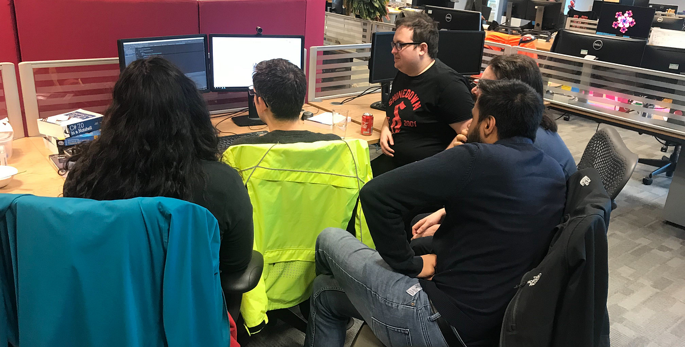
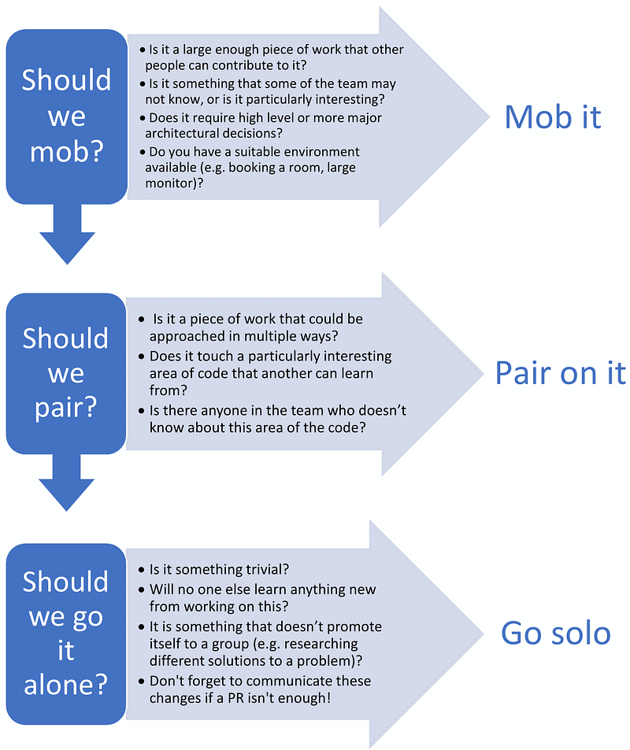

This year we’ve started a new team with some pretty crazy expectations. When we started working together at the beginning of the month, we had a clear goal but only a vague idea of what we needed to build. One of the team was an imported expert from another team working in the same area, so really everybody needed to be working with them most of the time.

Our main task this month has been to work through a couple of technical spikes. Our first spike we built from scratch to get used to some of the concepts involved. This proved we can build code for Oracle on linux platforms, neither of which we’ve done before in the team. That done, we’ve started spiking into the existing versioning codebase, trying to figure out what seams we’ll need to put in to switch between different platforms.

With that context, we’ve been using mob programming across the team for pretty much the entire month, and it’s been working really well.

The new Orca team around a single computer.

We’ve ended up trying out a few different methods for mob programming:

- **At a workstation:** just gathering around a computer.  
   **Pros:** It’s quick, easy and doesn’t need much organisation.  
   **Cons:** We’ve found that this doesn’t scale well — people at the back end up squinting at a small screen a lot, which makes it hard for them to join in.
- **Remote/distributed**  
   One person hosts and shares their screen, and drives most of the time. Other people can talk, and take control of the screen if something specific needs typing.  
   **Pros:** Works great for remote people, and everyone gets their own screen (so readability is better). We’ve even done this when everyone was sitting next to each other in the office, since it solves the problem with crowding around a single computer.  
   Additionally, people can drop in and out (or just watch) when they want, since we usually just have an open slack call in a public channel.  
   **Cons:** It’s easy to forget to keep talking sometimes, especially when people aren’t facing each other in real life. We’ve found that quiet moments are often solved by prompting the driver to talk about what they’re working on.
- **War-room**  
   One of the meeting rooms at RG Towers is set up for videoconferencing. We have tables and chairs in a circular setup around a set of monitors all showing the same image. One person can control the computer, while others watch the monitors in front of them.  
   **Pros**: Best of both worlds in some ways — can get everyone into one room, without squeezing everyone around one monitor. Everyone is still facing each other, so interacting is more intuitive than using voice chat.  
   **Cons**: It’s a specialized, shared meeting room, so it’s hard (and a little impolite) to book the room out for an entire afternoon. Since the room is actually designed for videoconferencing rather than mob programming, it might also be changed for other people’s purposes.

---

So far, mob programming has been incredibly helpful to spread knowledge across the team and get everyone up to speed quickly on what will probably turn out to be at least a year-long project. We haven’t been following any kind of formal process so far — just picking one person to be the driver and running with it — but mobs can get more formalized with specific driver/navigator responsibilities, which we may want to look into further.

It’s worth noting that like pair programming, being in a mob is hard work — and can be much more tiring than working alone. Instead of relaxing into some kind of flow state, we’re constantly thinking and talking about what’s going on. This is part of the reason that mob programming can be so effective, but taking regular breaks and rotating drivers is important to ease some of the load.

A decision tree we came up with for deciding how to approach work

While we’ve used mob programming for almost all of the last month, there are definitely some cases where it isn’t as appropriate. In particular, investigative tasks (which require a lot of code reading or googling for answers) are particularly hard to do together since everyone will read at different paces and have different ideas about where to go next. In these cases, splitting up for a while and coming back together later with some answers is usually the way to go.

---

Looking towards the future, we’ll gradually move from creating technical spikes and shift over to building real product code. We’ll likely end up taking on bigger, more independent tasks and working in a more multi-threaded way. This will mean more pairing and working solo in the future, but seeing how effective it has been, we’ll definitely want to continue mob programming whenever we can justify it.
