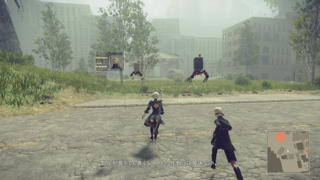

Recently I’ve been playing through Nier:Automata again, and trying to stick to Japanese for more of the playthrough. This is a bit of a challenge since my level of Japanese comprehension is still roughly about that of a two-year-old baby. I ended up taking a lot of screenshots like the one above and then [figuring out how to translate them](https://jisho.org/search/%E6%B0%97%E5%88%86%E3%81%8C%E8%89%AF%E3%81%8F%E3%81%A6%E3%82%82%E8%89%AF%E3%81%8F%E3%81%AA%E3%81%8F%E3%81%A6%E3%82%82%E3%80%81%E4%BD%9C%E6%88%A6%E3%81%AB%E3%81%AF%E9%96%A2%E4%BF%82%E3%81%AA%E3%81%84%E3%80%82) after the fact.

This started me wondering, though - surely all these subtitles were tucked away in the game files and could be extracted if we just had the right tools. And it turns out there’s a pretty dedicated mod community that does stuff just like this. After some investigation, I found two useful repos - [CriPakTools](https://github.com/nyctef/CriPakTools/) and [att](https://github.com/nyctef/att) - which handled pulling apart the games archive format and then the individual data files respectively. We can chain them together with a quick powershell script:

```
function att ($inDir, $outDir) {
    new-item -force -ItemType directory $outDir
    C:\git\micktu-att\x64\Debug\att.exe export $inDir $outDir
}

function cripakexport ($inFile, $outDir) {
    new-item -force -ItemType directory $outDir
    C:\git\wmltogether-CriPakTools\CriPakTools\bin\Debug\CriPakTools.exe -x -i $inFile -d $outDir
}

gci G:\SteamLibrary\steamapps\common\NieRAutomata\data\*.cpk | foreach {
    cripakexport $_ F:\nier_unpacked_2
}

att F:\nier_unpacked_2 F:\nier_unpacked_2_extracted
```

and get a nested folder structure full of files like this:

```
...
ID: M5920_S0100_G0040_001_op60
JP: いえいえ、そうではなくて。天気がいいと気分が良いのかなー、なんて。
EN: Not really! I just figured it might feel nice to have some good weather.
RU:

ID: M5920_S0100_G0050_001_a2b
JP: 気分が良くても良くなくても、作戦には関係ない。
EN: Feeling nice has no bearing on completing missions.
RU:

ID: M5920_S0100_G0060_001_op60
JP: ははっ……２Ｂさんらしいですね。
EN: Hee hee! That is so like you, 2B.
RU:
...
```

with the matching subtitle lines for English and Japanese, along with a `RU:` line (I believe the original author was working on a Russian translation)

This is already useful, but now we have a folder full of plain text files we can do some fun analysis, like this:

```
$folder = "F:\nier_unpacked_2_extracted"
$files = gci -recurse $folder | where { ! $_.PSIsContainer }
$fileContents = $files | foreach { gc -encoding utf8 $_.fullname }
$lines = $fileContents | foreach { if ($_ -match "^JP: (.*)$") { $matches[1] } }
$chars = $lines | foreach { $_.ToCharArray() }
$groups = $chars | group-object
$totals = $groups | sort-object -desc -property count
```

which finds the most common characters on all the lines in all files which begin with `JP:`:

```
Count Name                      Group
----- ----                      -----
11496 。                         {。, 。, 。, 。...}
11445 …                          {…, …, …, …...}
 9108 の                         {の, の, の, の...}
 8533 い                         {い, い, い, い...}
 6542 、                         {、, 、, 、, 、...}
 6529 て                         {て, て, て, て...}
 6401 に                         {に, に, に, に...}

 ...

  190 兵                         {兵, 兵, 兵, 兵...}
  185 話                         {話, 話, 話, 話...}
  185 奨                         {奨, 奨, 奨, 奨...}
  184 的                         {的, 的, 的, 的...}
  184 墟                         {墟, 墟, 墟, 墟...}

 ...
```

which is pretty neat. Obviously we get basic kana all over the top of the chart, but further down we start getting kanji like 体 (body), 機 (machine/mechanism/chance), 生 (life) and 命 (life/fate). A lot of these kanji end up in 機械生命体 (lit. machine-lifeform), the name of the enemies whose butt we're kicking in this game, which is probably not a coincidence. As you'd expect, the counts of character frequencies definitely look like they form some sort of power law distribution.

Anyway, this ended up being a pretty fun programming diversion - hopefully this'll turn out to be a useful resource for learning more sentences.
