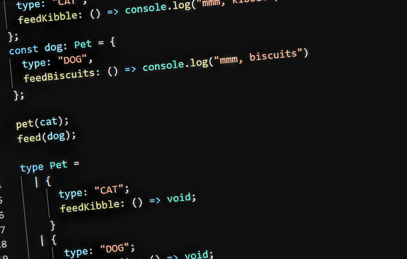

<i>2026 edit: unfortunately the repl.it embeds that this post were built around have died in the intervening years. The non-code parts are preserved, at least, but the code snippets will need recreating at some point</i>

Let’s take a toy problem, and use it to explore how the features available in different programming languages influence the way we write object-oriented code.

The problem itself is basic: we have a set of possible pet types (dog, cat, etc) and a set of possible operations on pets (feed, pet, etc). We’d like a solution which scales nicely as we add more pets or operations.

#### Approach 1: “Naive” OOP

We’ve got our domain object, “Pet,” and two subclasses for cats and dogs. We’ll implement the operations we want directly on the relevant classes, so everything is nice and simple.

For a toy example like this, and indeed for many simpler programs, this approach works pretty well:

It should be easy to imagine, however, what happens as our program grows in complexity. As we keep adding new things we want to do to our pets, each of the classes we have is going to grow and grow. I’ve seen several projects where the core “domain” objects became very difficult to maintain as they gained more responsibilities.

I think the fundamental mistake in what I’m calling “naive” OO here is to focus on using classes to model objects in the problem domain: most of the time it’s much more appropriate to have the code model its own processes in the solution domain. For a much better explanation on what this actually means, check out the [“Wizards and warriors” blog series by Eric Lippert](https://ericlippert.com/2015/04/27/wizards-and-warriors-part-one/comment-page-1/).

#### Approach 2: Separate behavior classes with switch statements

Our program doesn’t actually care about pets themselves: the point of the program is to feed pets, pet pets, and so on. We want to treat each operation on a pet as a separate responsibility: this should make it easier to work on each operation as separate features and add new ones.

In C#, we can use pattern matching with the switch statement to check the type of a variable and pull out a new variable of that type at the same time:

This works, but it has one large flaw: the switch statement is duplicated between `PetFeeder` and `PetPetter`. This causes problems when we want to add support for a new kind of pet: we need to find all the switch statements which need to be updated, and it’s very easy to miss one. This maintenance problem often causes people to swear off switch statements altogether and look for some other solution.

#### Approach 3: Pets as Factories

We can get a sorta-best-of-both-worlds solution by keeping the pets as god classes, but having them immediately delegate any actual behavior for each responsibility off to a separate object:

We end up with an explosion of classes here — one for each combination of pet type and operation. On the other hand, we’ve somewhat mitigated the problems with the previous two approaches: the Pet subclasses now contain a minimal amount of code related to all of their different responsibilities, and the compiler will force us to update all the appropriate code if we add a new factory to the base Pet class.

I think this approach is a reasonable tradeoff, but I’m still not a fan of how the pet classes have a direct dependency on all the different things that can be done with them.

An extension of this approach is to deny the Pet hierarchy altogether, and just treat a “pet” as a composition of petting and feeding strategies:

Now we don’t have a “dog” concept any more, except as a combination of a pet which we feed like a dog and pet like a dog. The pet class still knows about all the possible operations, though. I think this approach is most appropriate when the logic for different target objects is mostly the same, and specific implementation details might vary. For example, in [flyway’s `DBMigrate` class](https://github.com/flyway/flyway/blob/9d88603cca5199812714f5faa565e53f4e362770/flyway-core/src/main/java/org/flywaydb/core/internal/command/DbMigrate.java#L101), the overall migration process is the same, but specific strategies for interacting with different kinds of databases are injected.

#### Approach 4: the Visitor pattern

The visitor pattern is another common approach to try and solve some of the problems with switch statements. In the previous approach we were essentially building [double dispatch](https://ericlippert.com/2015/05/04/wizards-and-warriors-part-three/) into a language that doesn’t have it, allowing us to choose which method to call based on two parameters: the type of the pet we want to operate on, and the type of the operation we want to do. The visitor pattern makes this construct a bit more explicit.

The way that the visitor pattern works is that we get dynamic dispatch in two places: `IPet.AcceptVisitor` can call different methods at runtime based on the type of `IPet` it is called on, and then `visitor.Visit` can call different methods based on the type of the `IPetVisitor`.

This approach works, but it involves a load of boilerplate and the control flow bounces around in a way that can be really hard to follow, especially if someone isn’t already familiar with the pattern. It can also require multiple implementations for different method return types — even in languages with generics, we often require two different sets of visitor methods for `T`-returning and `void`-returning functions.

The big advantage to this approach over the previous one is that the Pet classes themselves now no longer know about the set of operations that can be done on them — they only need to know about the generic “visit” operation. New operations can be added without changing existing code. Additionally, the list of pets is only stored in one place — if we add a new pet type to `IPetVisitor` then the compiler will check that all the operations are updated appropriately.

#### Approach 5: Discriminated unions

With the visitor pattern, we were using boilerplate to build something that might have been a language feature. Discriminated unions, on the other hand, are an actual language feature that lets us fix the big problem with switch statements.

Discriminated unions are made up of two parts: a complete set of types, where a value must be exactly one of the members of the union, and a tag value which lets us tell which one it is.

Here, the union is `Pet` and the tag value is the `type` property.

The actual code uses switch statements like the second approach, but the big difference is that the compiler can now check that our switch statements are exhaustive. We can cause compile errors if we add a new type to our `Pet` union and forget to add it to one of the relevant switch statements.

(Interestingly, discriminated unions aren’t really a first-class feature in typescript, but fall out as a result of [typescript’s ability to narrow types](https://microsoft.github.io/TypeScript-New-Handbook/chapters/narrowing/) based on runtime checks)

#### Approach 6: Typeclasses

Many modern languages are adding support for discriminated unions, but this last option is a bit more niche. I’m going to try and write some Haskell here, but I am far from a Haskell expert by any means.

Typeclasses are like interfaces in other languages, but not exactly. The biggest difference for our purposes is that types can be made to implement typeclasses after the fact: in other languages, the interfaces that a class implements all have to be known by the class itself at the point where it is defined.

Here we’ve only implemented Pettable for Cat. If we wanted to enforce that an operation was valid over all pets, then we could define a tagged union similar to the one in typescript.

Personally this is the approach I like the idea of the most, even though I still don’t grok Haskell. We can add new operations by defining new typeclasses, provide implementations for each pet type by defining how that type is an instance of the typeclass, and this process can extend indefinitely without having to change existing code. Well, to a certain extent — see [this interesting blog post on “the expression problem,](https://eli.thegreenplace.net/2018/more-thoughts-on-the-expression-problem-in-haskell/.)” which is an extension of our pets-and-pet-operators example.

Some other languages may be adopting similar features. There’s [a proposal for adding typeclasses (referred to as “shapes”) to C#](https://github.com/dotnet/csharplang/issues/164), but it’ll be a long way in the future.

#### Summary

This was a toy example, but it’s hopefully a good demonstration of the problem where responsibilities accumulate on core domain objects and need to be pulled out. Splitting up classes by the behaviors they implement usually makes sense, but then we need a mechanism to make sure that the behavior classes can handle all the possible objects that they might need to operate on.

I found it particularly interesting how the more functional languages I tried (typescript and haskell) seem to solve this problem better than the supposedly object-oriented ones did — one of the things I’ve found more and more is that splitting apart state and behaviors and putting them in separate classes tends to lead to better designs, and that ends up pushing the code to a more functional style.
