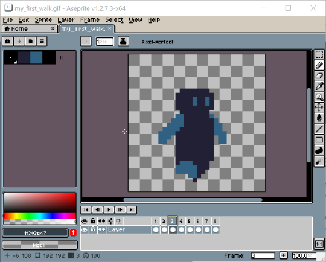
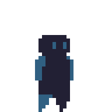
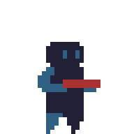
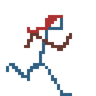
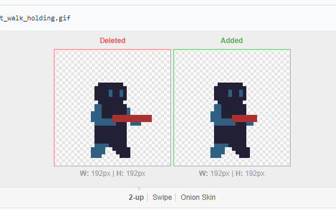

So recently I was playing Celeste (which is just a wonderful game) and between that and a few other things I was inspired to try out learning how to do some basic pixel art. The great thing about pixel art is that it’s very accessible - you can create it in pretty much any image editor you can imagine. Doing animation can be a bit trickier, though, so I ended up shelling out ten quid for Aseprite, because there’s something just right about creating pixel art in a UI built out of pixel art:

Anyway, I started following [some basic tutorials](https://www.youtube.com/watch?v=y6Igao5Uvu8) and quickly ended up with something that actually worked:

After that I stated experimenting and gave my little robot something to hold:

and started trying out some other run cycles (not nearly as developed yet):

One pleasant surprise I found was that github displays gif diffs pretty nicely:

which really helped with seeing the changes/improvements I was making at each step.

Also, Aseprite includes a commandline tool, so I got to automate the creation of gifs+sprite sheets from the custom .aseprite files that the editor normally deals with with [a simple powershell script](https://github.com/nyctef/sprites/blob/0b744678b791e047455c430eecaaa954972855b7/build.ps1)

Anyway, I’m only a few hours in here, so I hope to get more time to spend on more tutorials and experiments
