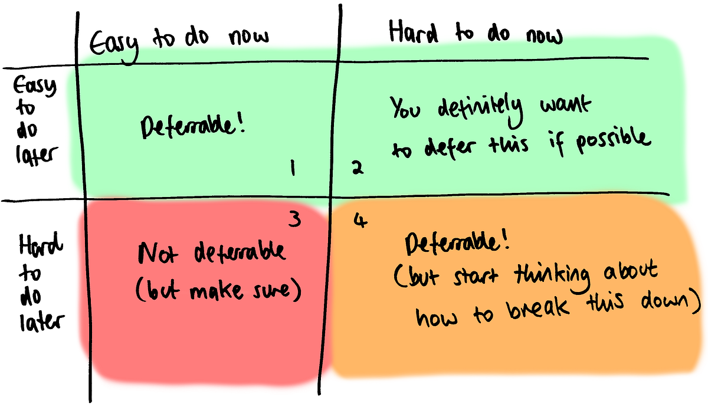

> We have an innate dislike of uncertainty. Our confirmation bias serves to make us think we have certainty and understand the patterns we see, even when we don’t. That’s great for helping us move forward in an uncertain world… but if we could move forward in a way that kept _two_ directions open for us, cheaply, why wouldn’t we?  
>  *—* [_Liz Keogh:_](https://lizkeogh.com/2017/09/08/on-real-options-and-speculative-investments/) [_On Real Options and Speculative Investments_](https://lizkeogh.com/2017/09/08/on-real-options-and-speculative-investments/)

Financial options are a tool that let the option purchaser reserve the right to buy or sell an asset, at a set price, some time in the future. In return for this guarantee, the option purchaser pays a small premium to gain the option.

Options can be used to reduce risk in an uncertain future (“I’ll reserve some materials now, so we’re not caught out by price hikes in the busy season”) or to gamble on upcoming events (“I think this stock is going to go up in a month, so I’ll reserve an option to buy it cheaply then”). Notably, the option is not an obligation: if the materials stay cheap, or if the stock goes down instead, the option doesn’t get exercised. The purchaser only loses the small premium they paid for the option initially.

“[Real options](https://corporatefinanceinstitute.com/resources/knowledge/valuation/real-options/)” is an application of the theory around financial options to more general business decisions. Like financial options, decisions have intrinsic value and can be deferred until they’re actually necessary.

---

> Behaviour Driven Development and Test Driven Development provide many options, especially “the option to change the software, knowing when you have broken it.” [… The ability to refactor] removes the need for design commitments, the choice of design can be deferred until after the coding has started.  
> _—_[_Olav Maassen/Chris Matts: “Real Options” Underlie Agile Practices_](https://www.infoq.com/articles/real-options-enhance-agility)

We can take many of the same ideas and apply them to engineering decisions as well! Agile is full of options. For example, one oversimplified description of Scrum could be “We reserve the option to update our direction every two weeks.” Sprint planning, backlog management, story creation: these are just the costs we pay to gain that option.

A lot of what we call “good design” boils down to purchasing options. For example, we might put an abstract interface around our persistence layer so that we have the option of swapping out a different implementation later on. Even if we don’t change the implementation entirely, the option to modify one layer without affecting others is still valuable. The cost of this option is usually some refactoring work and having to maintain some extra code around the abstraction layer itself.

Often we don’t take full advantage of the options we have available, though. We might find ourselves spending time early on implementing a database layer that we think will be necessary in the future, even if a much simpler flat file system would work just fine for a while. We get too fixated on the “correct” solution, and forget how the right abstraction and tests mean we genuinely have the option to do it properly later.

---

> Given any decision to be made, there are three possible decision categories, namely, a “right decision”, a “wrong decision” and “no decision”. [Normally] the optimal decision is in fact “no decision” as this defers the commitment until we have more information to make a better informed decision.

> However, if we observe the behaviour of most people, we notice that an aversion to uncertainty means people make decisions early…  
>  *—* [_Olav Maassen/Chris Matts: “Real Options” Underlie Agile Practices_](https://www.infoq.com/articles/real-options-enhance-agility)

A different kind of option is to defer some work entirely. To go back to the persistence example, let’s imagine we haven’t already done the work to pull our persistence layer apart, and we think it might need a significant bit of refactoring work. As professional software developers, we feel a strong urge to do things properly and make the refactoring happen. But we don’t have to do it straight away! _Whether to purchase the option or not_ is another choice that we can make.

When we’re figuring out what features to work on, we might draw up a list of all the obvious things we need to implement for v1, and start working through them. But this is missing a trick when we have the option to prioritize riskier features first, and defer implementing the obvious stuff until later. This is a fairly standard Agile insight, but thinking about prioritization by trying to come up with as many options as possible can help us avoid falling into the common traps here.

Useful questions to ask are:

- When is the deadline for the change?
- How long do we expect it to take?
- What’s the risk that it will take significantly longer than that?

Answering these will tell us the expiry date for the option to do that work, and suggests how much (potentially more useful) work we can squeeze in ahead of it.

Also, ask yourself if the change will get easier or harder over time:

- How hard will it be to do this change now?
- How hard will it be to do this change in a year’s time?

Because every good idea needs a 2x2 matrix

If a change is easy now and will stay easy later, you can put it off: this is a deferrable decision.

Some changes are hard now and easy later, usually because we’re planning some other change in the meantime which will make it easy: these changes are obvious candidates for deferring.

If it’s easy now and will become hard later, then this is a good sign that we probably shouldn’t defer the change. However, we need to be critical here. When introducing refactorings or abstractions in particular, it’s common to believe that changes are best done early, lest the code tangle itself around the nice clean layers we want to introduce. This is even true sometimes. Beware of speculative generality!

If it’s hard now and will stay hard in the future, then we can safely defer the change without impacting how hard it will be. However, we might want to start thinking about intermediate changes we can do to shift this up into the second category. Keeping thoughts about these hard changes in the background while working on some other tasks can often lead to some useful insights about how to tackle them and break them down into smaller, easier changes.

**The true skill is being able to accurately tell the difference between the first category (easy/easy) and the third (easy/hard).** Try to be aware of which way you’re biased here: everyone leans one way or the other. (Personally, I usually bias too much towards thinking things are easy, unless it’s something that I’ve had trouble with in the past: then I’ll claim it’ll become hard and must be solved immediately). **I don’t have any good answers on how to develop this skill except through experience, but knowing that the skill exists and that options are an available tool is a good first step.**

Some useful alternate questions: “How risky is it do the change now? What about later?” and “Will we learn more or less by doing the change later?”

---

> We do something that Dan calls “Spike and Stabilize” — trying one or several things quickly to get feedback, then stabilizing the end result after we’ve managed to eliminate some of the uncertainty around what we’re doing.  
>  *—* [_Liz Keogh: Beyond Test Driven Development_](https://lizkeogh.com/2012/06/24/beyond-test-driven-development/)

An easy way to generate options is to split tasks into two: the effort required to do the work quickly, and the additional effort required to do it properly. As professional software developers, we often tightly bind these two efforts together. We have a well-justified fear that the work will never get done properly unless we force it to be done properly from the beginning.

Interesting things happen if you treat “doing it properly” as a deferrable real option, though. Let’s say we implement a feature quickly, and then take an option on cleaning up the code we wrote: adding tests, writing documentation, that sort of thing. We’ll create a deadline for exercising the option or not within six weeks (because we definitely don’t want to forget about it and leave the code in a poor state). What happens next?

Well, one thing that might happen is that the code has remained untouched for six weeks, so we just do the cleanup we committed to and carry on. We haven’t gained or lost anything here — once the six weeks are up, the codebase looks like it would have if we’d done everything properly in the first place.

Another thing that could happen: some other code ended up interacting closely with our change. We want to make sure we avoid getting our unclean code tangled and drifting into the “hard to do later” part of the matrix, so we cleaned it up early. Again, we haven’t really gained or lost anything this way.

The final thing that might happen is that we come to the end of the six weeks, and it turns out the code we need to clean up has gone. This is the real win in the process: in the other two cases, we proved that the code was useful one way or the other, but it might turn out that we just want to go in a different direction and not use that code at all. Deferring the cleanup makes it easier to try out different directions, make more experiments, and generally be more agile. Conversely, the more we make experiments, the more code we’ll be able to write which doesn’t survive six weeks, and the more time we’ll be able to save!

Dan North calls this pattern “[Spike and Stabilize](https://dannorth.net/the-art-of-misdirection/).” [Gareth Bragg](https://medium.com/u/edd7ee127ad6) has written [a useful series of articles on Spike and Stabilize](https://medium.com/ingeniouslysimple/building-features-with-spike-stabilise-1906a9006a87) already if you want to find out more.

---

Real options can be hugely powerful, but fundamentally require trust in the process. Humans hate uncertainty, and one way to assuage uncertainty is to put a time limit or hard condition on when a decision will be made. Options require discipline: we usually can’t just put off decisions indefinitely, although you might be surprised at what you can get away with.
