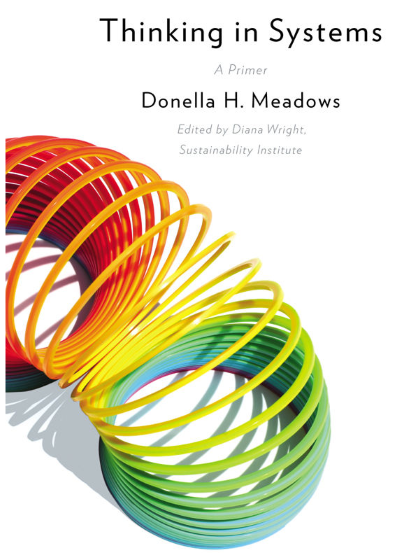
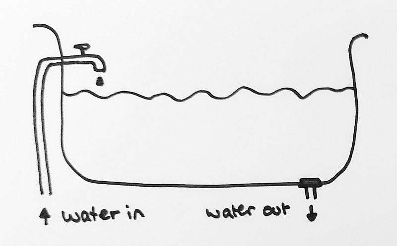
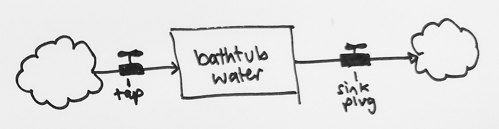
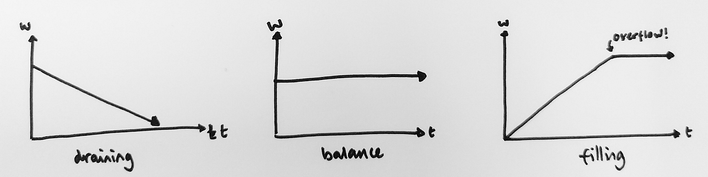
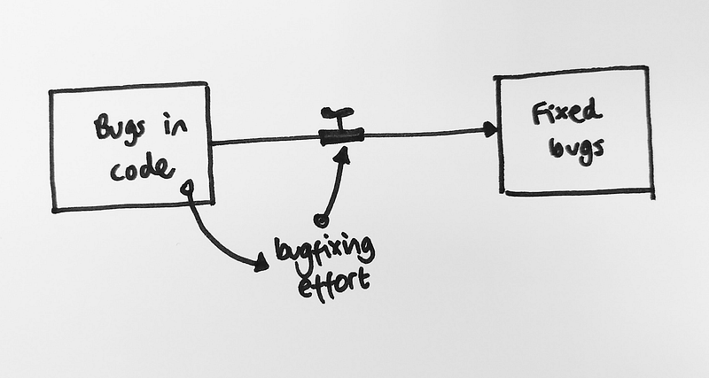
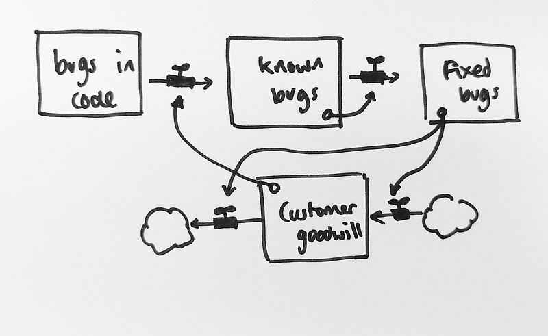
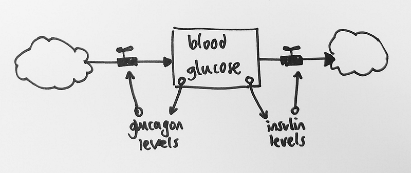
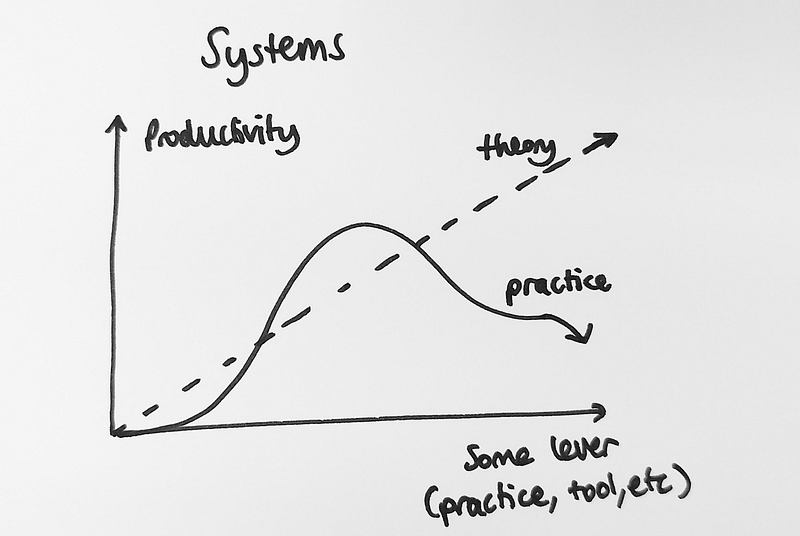

A few months ago, a group of Redgaters went to nor(dev):con — a tech conference in Norwich, full of interesting talks. I happened to be reading Donella Meadows’ excellent book _Thinking in Systems: A Primer_ on the train: since then I’ve been thinking on and off about systems thinking and how it might be applied to some of the talks we saw during the day.

---

So what are systems, and what does it mean to think in them? The book defines systems as some set of things — cells, people, companies, economies, or whatever — “interconnected in such a way that they produce their own pattern of behavior over time.” The key insight in systems thinking is that those patterns of behavior are **not** driven or controlled by any of the individual actors within the system, but **by the system’s own structure**: the way that resources and information flows within the system.

Systems thinkers often model systems as structures of **stocks** and **flows**. Stocks are stores and quantities of some thing: either concrete like warehouse inventories, or abstract like knowledge on some particular topic. Flows are processes that change stocks over time.

To provide an example from the book, imagine a simple bathtub with a tap providing water, and a drain removing it:

<figure>

</figure>

We can abstract this into a diagram showing the stock (the amount of water in the bathtub) and the two flows which increase or decrease the amount of water:

<figure>

<figcaption>A stocks-and-flows diagram for the bathtub. The rectangle represents the water level and arrows represent flows. The “faucets” on each flow control the amount of the flow. The clouds at either end abstract hide away some other system that we don’t care about — all systems are interconnected!</figcaption>
</figure>

We can also model the system over time by graphing the level of the stock:

<figure>

<figcaption>Three possible graphs for the water level stock (w) over time (t). In the first case, the water is drained faster than it is being supplied, so the stock level decreases. The second graph shows an equilibrium case: both flows match (they might or might not be stopped). In the third graph, the bathtub fills until it starts to overflow.</figcaption>
</figure>

In the third graph, the input from the tap dominates the output from the sink, so the level of water steadily rises — until a new behavior emerges and the water overflows! Interesting systems tend to exhibit surprising, nonlinear behavior.

The book goes into more detail with various examples, but one of the most important conclusions is that stocks add a buffer between cause and effect. Feedback always has a delay, and this delay can be fatal if we react too slowly or too quickly to feedback.

---

Tying into that theme on feedback, the keynote at Nor(dev)con was [Liz Keogh’s talk “The Failure of Focus”](https://www.infoq.com/presentations/strategies-develop-complex-systems): an introduction to the [Cynefin framework](https://lizkeogh.com/cynefin-for-everyone/) (pronounced “kuh-nevin”) with five contexts for making decisions in.

- Obvious: we’ve done this before, nothing is surprising, just apply best practice. There is one right answer.
- Complicated: Less obvious, but we have some good practice to apply and correlation between input and output is predictable. There are a range of right answers.
- Complex: Unknown unknowns appear, and problems are “wicked”. We need to probe to see what happens, and try to solve problems to figure out what the problems are. Correlations are unpredictable and results only make sense in hindsight.
- Chaotic: Everything is on fire. The situation is both urgent and novel. The only thing to do is act immediately, with something that seems sensible based on an immediate intuition, and see what happens.
- Disorder: One of the above, but we don’t know which. This is the most dangerous domain, because trying to apply decision-making techniques from the wrong domain will usually go poorly.

I’m not going to do justice to Liz’s talk here — you should really watch the whole thing if possible. The main point is that we’re often so worried about the chaotic domain that we do a really bad job of handling complexity (and try to pretend that complex situations are predictable, with bad results).

These different domains in Cynefin describe how much we know about the system. One way to think about this is related to the concept of nonlinearity from earlier: complex systems are nonlinear and there isn’t a predictable correlation between input and output, or cause and effect.

Liz gave an example of a complicated system: a team of devs who had a problem with bugs, so they started tracking reported bug count as a metric and tried to push it down.

<figure>

<figcaption>A very simple model for fixing bugs. The arrows with circles show feedback mechanisms: here the amount of bugs in the code affects how much effort is put into bug fixing, which should in turn affect the flow from “bugs” to “fixed bugs”.</figcaption>
</figure>

This succeeded for a while, but after doubling down on bugfixing effort, **the number of bugs went up!** Rather than any obvious metric failures or drops in quality, it turns out users had noticed bugfixes going on, and started reporting more bugs — the newly-reported bugs had been there from the start.

<figure>

<figcaption>A slightly more complete model for fixing bugs. Only known bugs can be fixed, and how many bugs are fixed affects customer goodwill. When customers have trust in the developers, the number of known bugs will increase as customers report more bugs.</figcaption>
</figure>

---

Later in the day, Jon Jagger’s Miscellaneous Process Tips talk provided an another example of systems thinking. The [glucose cycle](https://en.wikipedia.org/wiki/Glucose_cycle) (when it functions correctly) is a classic example of two feedback loops resulting in a stable state.

After eating a donut, for example, the body receives an influx of sugar. Beta cells in the pancreas react to the higher blood glucose levels by emitting insulin. This insulin causes organs to consume more glucose, and the liver to store excess glucose as glycogen. The effect is a feedback loop which balances out increases in blood sugar. An opposing feedback loop happens when glucose levels are too low: alpha cells producing glucagon cause stored glycogen to be turned back into glucose.

<figure>

<figcaption>A basic diagram of blood sugar regulation, showing how glucagon levels and insulin levels affect the flow of glucose into the blood. We could add more detail by treating glucagon and insulin as their own stocks, and modelling more of the system that way.</figcaption>
</figure>

Jon talked about how so often stability is the result of two processes furiously working to oppose each other. The idea of stability built on top of activity may seem unintuitive, but often there has to be [some correcting mechanism](https://en.wikipedia.org/wiki/Le_Chatelier%27s_principle) or any equilibrium will be unstable: stable systems oppose their own function.

Systems thinking can potentially explain problems with change management as well. In his talk, Jon explained how a naive manager might treat introducing some technique or tool as a lever that just works linearly: pushing the lever more and more results in higher productivity. But thinking back to our bathtub example with the nonlinearity when the overflow happened, or realising that people and companies are incredibly complex systems with many feedback and reinforcing loops: these help us realise how basic, sensible intuitions about our work can cause serious problems down the line.

---

In the end, I’m not sure I “get” systems thinking yet — it seems really easy to draw stocks and flows diagram, but they might be too general: it’s hard to know if any given diagram reflects reality or not. I think they may be more of a tool for being explicit about current understanding, rather than generating new insights.

But either way, I’d recommend reading the Thinking in Systems book: it’s a fascinating read, and might just change how you see the world for the better.
