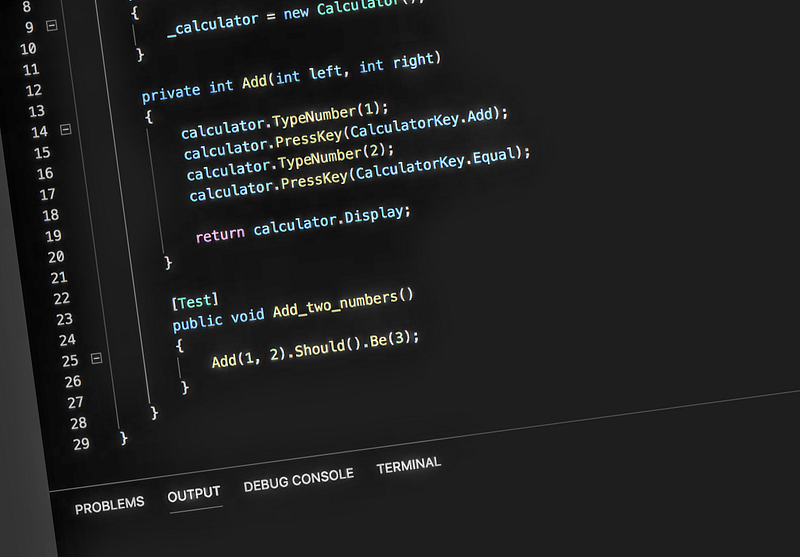

Test code is a different beast than non-test code. We generally want our tests to be extremely simple and easy to read: if they’re not, then we have much less confidence that the tests are correct, nevermind the underlying code that they’re actually testing! (Have you ever written tests for your tests?)

---

This all sounds pretty obvious, but it means a lot of the approaches we consider to be obviously good style for writing production code are actually a bad idea for tests. You may have heard of this dichotomy referred to as [“DAMP” vs “DRY”](https://stackoverflow.com/a/11837973). To explain what I mean some more, I’ll show an example of some tests that my team was looking at a few months ago:

```
        [Test]
        public void ReturnsMigrationId_From_HeaderTextWithValidId()
        {
            const string migrationId = "8c7f0a68-cb89-4eba-ad89-0648cf8c581f";
            var headerText = $"<Migration ID=\"{migrationId}\" />";
            var id = MigrationMetadataReader.GetMigrationId(headerText);
            Assert.AreEqual(migrationId, id);
        }

        [Test]
        public void ReturnsEmptyString_From_HeaderTextWithInvalidId()
        {
            const string migrationId = "8c7f0a68-cb89-4eba-ad89-0648cf8c581f";
            var headerText = $"<Migration InvalidId=\"{migrationId}\" />";
            var id = MigrationMetadataReader.GetMigrationId(headerText);
            Assert.AreEqual(string.Empty, id);
        }
```

While some deduping has happened here already (note the `migrationId` variable for example) there’s obviously a lot of information duplicated between these two tests. We initially did a refactoring pass to end up with this:

```
        private const string MigrationId = "8c7f0a68-cb89-4eba-ad89-0648cf8c581f";

        [Test]
        public void ReturnsMigrationId_FromHeaderText_WithValidIdXmlTag()
        {
            var validHeaderText = CreateValidHeaderText();

            var id = MigrationMetadataReader.GetMigrationId(validHeaderText);

            Assert.AreEqual(MigrationId, id);
        }

        [Test]
        public void ReturnsEmptyString_FromHeaderText_WithInvalidIdXmlTag()
        {
            var invalidHeaderText = CreateInvalidHeaderText();

            var id = MigrationMetadataReader.GetMigrationId(invalidHeaderText);

            Assert.AreEqual(string.Empty, id);
        }

        private static string CreateValidHeaderText()
        {
            return CreateHeaderText("ID");
        }

        private static string CreateInvalidHeaderText()
        {
            return CreateHeaderText("InvalidID");
        }

        private static string CreateHeaderText(string migrationTag)
        {
            return $"<Migration {migrationTag}=\"{MigrationId}\" />";
        }
```

We’ve viciously stripped out any duplication from these tests, but we’ve also made them a lot more complicated. Are the tests harder to read now?

Comparing these first two versions, it’s interesting how pulling out methods to abstract ideas can make the code more readable in some ways, and less readable in others. You need to read more lines of code to fully understand the test, so in some ways the second version is objectively less readable, but there’s also a hope that the more abstract version reduces the need to understand everything at once. However, I think everyone agreed that the `MigrationId` constant being pulled out and invisibly shared between different methods definitely made the code less readable!

After some discussion, this is what we finally ended up with:

```
        [Test]
        public void ReturnsMigrationId_FromHeaderText_WithValidIdXmlTag()
        {
            const string validHeaderText = "<Migration ID=\"THIS IS THE MIGRATION ID\" />";

            var id = MigrationMetadataReader.GetMigrationId(validHeaderText);

            Assert.AreEqual("THIS IS THE MIGRATION ID", id);
        }

        [Test]
        public void ReturnsEmptyString_FromHeaderText_WithInvalidIdXmlTag()
        {
            const string invalidHeaderText = "<Invalid>";

            var id = MigrationMetadataReader.GetMigrationId(invalidHeaderText);

            Assert.AreEqual(string.Empty, id);
        }
```

We’re back to nice, simple tests which are actually more readable than before. The `migrationId` duplication actually turned out to be a red herring — our definition of “invalid” ID tags was actually a lot less subtle than that. We also didn’t need a GUID string for the ID — the [deliberately meaningless](https://github.com/testdouble/contributing-tests/wiki/Meaningless-Test-Data) `THIS IS THE MIGRATION ID` value ended up working a lot better. It’s obvious enough to not need its own variable, reducing the amount of code the reader has to understand.

In the end, what we’re testing is an extremely simple pure function which just takes and returns a string: if our tests are much more complicated than our code, then that’s a smell we’d want to pay attention to.

---

Around the same time we attended a TDD workshop run by [Alex Tercete](https://medium.com/u/1c663236a75) which focused on refactoring tests to [write more usable code](https://github.com/alextercete/writing-testable-code-workshop).

The example tests looked roughly like this:

```
        [Test]
        public void Add_two_numbers()
        {
            var calculator = new Calculator();

            calculator.TypeNumber(1);
            calculator.PressKey(CalculatorKey.Add);
            calculator.TypeNumber(2);
            calculator.PressKey(CalculatorKey.Equal);

            calculator.Display.Should().Be(3);
        }
```

with many more tests doing something similar. In the exercise, we tried “listening to the tests”, refactoring them into a framework which was much easier to use:

```
        private Calculator _calculator;

        [SetUp]
        public void SetUp()
        {
            _calculator = new Calculator();
        }

        private int Add(int left, int right)
        {
            calculator.TypeNumber(left);
            calculator.PressKey(CalculatorKey.Add);
            calculator.TypeNumber(right);
            calculator.PressKey(CalculatorKey.Equal);

            return calculator.Display;
        }

        [Test]
        public void Add_two_numbers()
        {
            Add(1, 2).Should().Be(3);
        }
```

So, should we stop here? I think the answer is **absolutely not**. We’ve gotten some good feedback from the tests, but we’ve now muffled the problem by wrapping our underlying code with the test framework. If we leave it here, then we keep all the problems with the underlying code, but we’re no longer feeling that pain through the tests, so it’s more likely to become a problem.

We have one of two choices:

- **Take the new API** we’ve defined using the testing framework, and apply it to the underlying code. For most situations, the more functional-style `Add(1, 2)` method is a lot easier to use and compose with other pieces of code, so this is a good improvement. This is a good example of how “listening to the tests” in TDD can improve the design of the underlying code.
- Keep the old API and **remove the testing framework**. It might turn out that our `Calculator` object is actually modelling some UI, where the `TypeNumber` and `PressKey` methods map onto actual textboxes and buttons. In this case the old API would be more correct, so we should stick to testing that and inline our testing framework back into the tests.

One case where the above might not apply is when the test helper code is dealing with some shared resource instead of wrapping the tested code directly. For example, if we’re writing integration tests for code that integrates with a database, we often end up needing helper functions to provision and clean up test databases. This kind of framework can be very useful, but it still needs to be kept separate from the rest of the code. I’ve seen that it’s quite easy for the sort of API wrapper code we’ve been talking about above to creep into the database testing framework.

Obviously this is a toy example, but hopefully you can see how the same approach could be used for real code. I’d encourage you to try something similar when you find yourself with a lot of test helper code.

---

To sum up, we should write tests where [each test is independently readable and understandable](https://8thlight.com/blog/thomas-countz/2019/02/19/essential-and-relevant-unit-tests.html), and try to avoid the temptation to de-duplicate test code as much as production code. When I’m debugging a test failure, I want the entire test to fit in my head. We need to keep an eye out for large test frameworks building up in our code, and use that as a sign that the underlying APIs want to be fixed.
