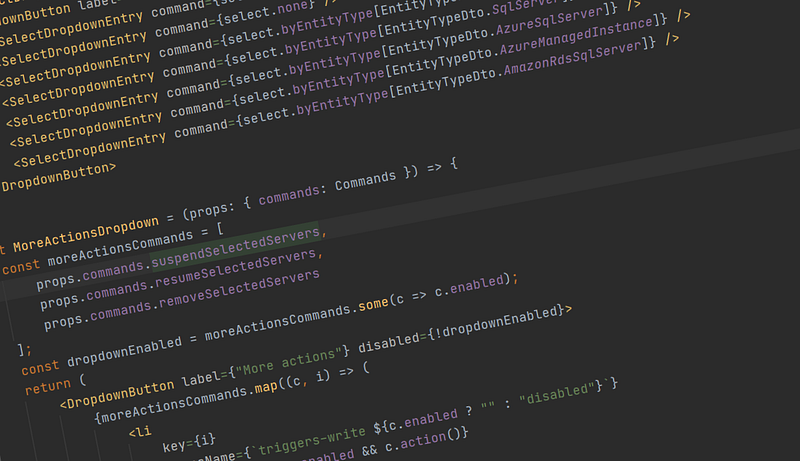

What makes learning vim worthwhile? While I’m far from a vim guru, and it often gets in the way, it speeds up editing code to the point where I think it’s definitely worthwhile. And with most modern editors supporting some form of vim emulation, it really becomes a skill that you can take anywhere you want to work.

The most important concepts to start getting value from vim are [_motions_](http://vimdoc.sourceforge.net/htmldoc/motion.html#left-right-motions) and [_operators_](http://vimdoc.sourceforge.net/htmldoc/motion.html#operator)_._ Unlike other keyboard shortcuts, vim commands are made up of composable parts that you can recombine and reuse.

For example, in another editor we might have the keyboard shortcuts `Ctrl-Delete` to delete the rest of the word from the cursor, or `Ctrl-Backspace` to delete the other half of the word up to the cursor. In vim the equivalent normal-mode commands would be `dw` (mnemonic: “delete word”) and `db` (“delete back a word”).

The crucial thing here is that these commands are actually a combination of `d` (an operator) and `w` or `b` (which are motions). We can use both of these in other contexts! Since `w` and `b` are motions, just pressing those keys by themselves will move the cursor the same distance. The delete command `d` can be swapped out for any other command, such as `c` (“change”) or `y` (copy, or “yank”).

What if we want to delete a whole bunch of text instead of one word at a time? Well, the search command `/` is a motion, so we can just type `d/Some more text<Enter>` and all the text from the cursor’s current position moving to the search result will be cleared out.

Each time you learn a new command or motion, the amount of things you can do in vim increases dramatically!

The last concept I want to introduce here is [_text objects_](http://vimdoc.sourceforge.net/htmldoc/motion.html#object-select). These are similar to motions, but are only used with an operator. Going back to our earlier example, what if we have the cursor on a word and we want to delete the entire thing? We could just delete forwards, then backwards using `dw` and `db`. However, we could also do `diw`: “delete inside word.” `iw` here is a text object: a block of text defined by some boundary. Text objects come in matching pairs: objects starting with `a` include the boundary characters, while objects starting with `i` do not. So we also have `daw` “delete around word” which will also delete some of the surrounding whitespace.

One text object I use a whole lot is `i"`/`a"` for working with strings. I find `ci"` (“change inside string”) very useful for replacing the contents of a string, and `ca"` (“change around string”) will replace the string altogether. Here’s a few more examples:

- `di}`: delete all code inside the current set of <b>`{}`</b> curly braces.
- `ca)`: replace wrapping <b>`()`</b> parentheses and contained code with something else.
- `dat`: delete the current (html) **t**ag.

---

Which finally brings the topic to vim-surround. Remember how text objects had two types: `i` and `a` for whether the boundary characters were included or not? vim-surround adds a new type: `s` (or “surrounding”) which _only_ includes the boundary characters, not the contained text.

One scenario I’ve found this really useful is when editing React components. As a first example, let’s say we have the following tag:

```
<div id="my_cool_tag" className="style1 style2 style3" />
```

We realise we need to add an optional fourth class in some cases, and we want to use an interpolated string to do so. This is a little tricky, since we now need to enclose the string in `{}` curly braces, and change the quote types.

We start by putting the cursor inside the `className` string, and type `ysa"}` . This command has three parts: `ys` to add a new surrounding, `a"` to define the text object we want to surround, and `}` the surrounding characters to add. The result (“surround surrounding `"`with `}`”) is the following:

```
<div id="my_cool_tag" className={"style1 style2 style3"} />
                                ^----------------------^
```

Not much by itself, but it means we can now change the `"` string to a `` ` `` string with `` cs"` `` (“change surrounding quotes to backticks”):

```
<div id="my_cool_tag" className={`style1 style2 style3`} />
                                 ^--------------------^
```

Now we can type `` f` `` to skip to the backtick at the end of the string, `i` to get into insert mode, and type out our new style:

```
<div id="my_cool_tag" className={`style1 style2 style3 ${someCondition && "style 4"}`} />
                                                       ^---------------------------^
```

While it might not be super-impressive at first, vim-surround has saved us from a lot of tedious back-and-forth to edit each end of the string here. I’ve found the benefit definitely adds up over time.

---

Conclusions:

- “Vim” is really just a set of keyboard shortcuts for efficient code editing — you don’t need to use vim directly to benefit!
- Vim’s power comes from the fact that commands are made up of composable, reusable parts.
- Plugins like vim-surround make editing code even easier.

I hoped that helped!

_If you want to write React code, have you considered_ [_looking at a job at Redgate_](http://bit.ly/3t1Lp9o)_? We’ve got more and more teams using React, and we’re committed to supporting remote working through 2021. I’m sure we’d love to have you aboard!_


