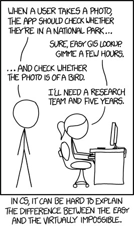
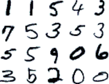
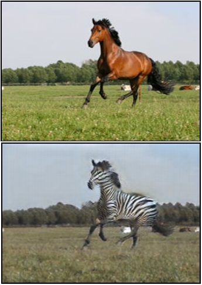

Most of the time when we’re writing computer programs, we’re essentially giving the computer a set of rules and procedures for solving a single problem. The computer takes some input, steps through the procedures that it has been given, and then produces some output in a precise and deterministic way. If we’re lucky, then the rules we’ve programmed into the computer will have been correct, and the computer will give us useful output.

However, some problems are too difficult for a human to just write down a program to solve them. For example, although we find it intuitively very easy to determine whether a given picture contains a photo of a bird, once the image has been digitalized and turned into a stream of millions of numbers (representing individual pixel values) with no discernable structure, it’s essentially impossible to figure out what the original image might have contained.

Instead of trying to write down a program and put it into the computer directly, we can try to give the computer tools to figure out its own program. We’ll provide the computer with hundreds or thousands of examples of correct input and output, and get the computer to figure out the rules in the middle that transform one into the other. This is the process that ‘machine learning’ generally refers to.

“In the 60s, Marvin Minsky assigned a couple of undergrads to spend the summer programming a computer to use a camera to identify objects in a scene. He figured they’d have the problem solved by the end of the summer. Half a century later, we’re still working on it.” [xkcd.com/1425](https://xkcd.com/1425/)

### What is machine learning good for?

One of the biggest differences between machine learning and regular programming is that machine learning algorithms are inexact. The success of a given algorithm is generally scored by how much of the test data is processed correctly, rather than if the algorithm manages to be completely correct. This means machine learning programs can be appropriate where fuzziness is required (eg suggesting things to the user, searching through data, or interpreting anything that humans do) but should probably be avoided where exact, deterministic algorithms are already known.

The most well-known applications of machine learning are interpreting images (computer vision), sound (speech recognition) and text (natural language processing) — trying to take fuzzy, real-world information and translate it into a form that can be more easily handled by other computer programs.

A sample of handwritten digits from the MNIST dataset. The best machine learning programs for recognizing these digits get around 0.2–0.3% error rates — not perfect, but very close.

### What resources are available?

There’s a huge amount of content about machine learning on the internet, but recently I’ve been following through a couple of Coursera courses that I can recommend:

- [Machine Learning from Stanford University](https://www.coursera.org/learn/machine-learning/) — A more general course that covers a wide variety of machine learning algorithms and applications. This was also recommended in the machine learning workshop that Amy Nicholson ran on Tuesday.
- [Neural Networks for Machine Learning from the University of Toronto](https://www.coursera.org/learn/neural-networks/). Particularly notable for being taught by Geoffrey Hinton, who has been at the forefront of machine learning research for the past several decades. This course is a bit more challenging and I haven’t finished yet, but it goes into much more depth about various types of neural networks.

Both courses are a mix of video lectures, quizzes and programming assignments which provide a little bit of experience with the internals of how machine learning algorithms work, although not so much detail on real-world applications.

- [Learning to Code: Machine Learning for Program Induction](https://www.microsoft.com/en-us/research/video/learning-code-machine-learning-program-induction/). Most machine learning algorithms generate hard-to-interpret ‘black box’ models, but Alexander Gaunt describes how it may be possible to generate programs that humans can understand as well.
- [Machine Learning for Artists](https://www.youtube.com/watch?v=z0bynQjEpII&list=PL_78NoHMtmJrClXArZUkZRZ1gPe4411E7). A great overview of various machine learning topics, along with some intuition on how neural networks can work. Gene Kogan’s videos also discuss using machine learning algorithms to generate content (such as the zebra photo on the right) in addition to just interpreting existing data.
- Amy Nicholson’s workshop introduced us to the wide variety of machine learning services available on Azure, which include some very simple REST interfaces that are straightforward to use: see [azure.microsoft.com/en-gb/services/cognitive-services](https://azure.microsoft.com/en-gb/services/cognitive-services/) for more details.

Of course, this is just a tiny fragment of what’s available and I’m far from an expert in any of this stuff. However, I hope this was interesting and possibly inspired you to think more about what you could do with machine learning in the future.

Above: a photo of a horse  
Below: a ML-generated zebra  
Source: [github.com/junyanz/CycleGAN](https://github.com/junyanz/CycleGAN)
